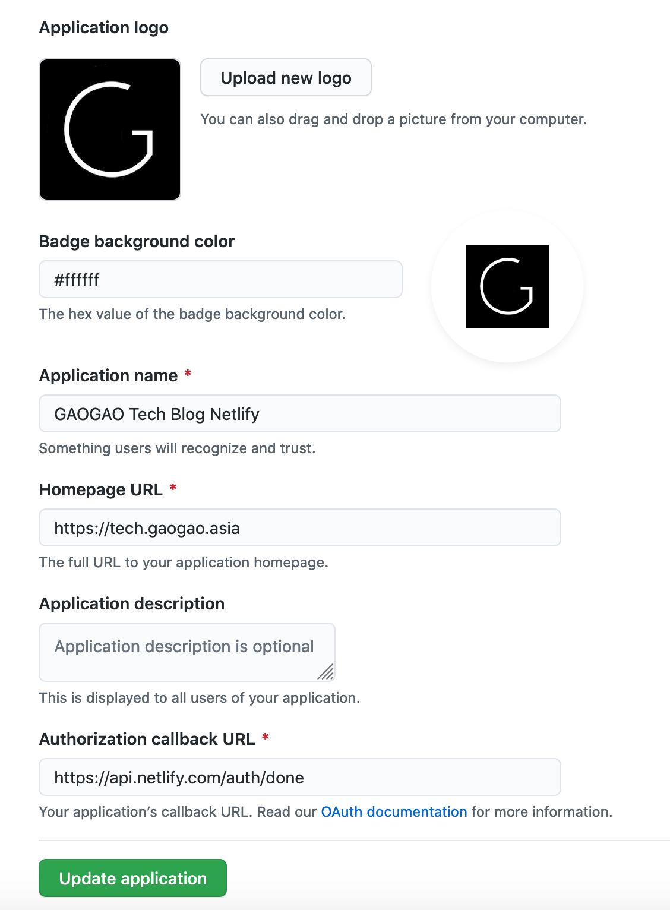
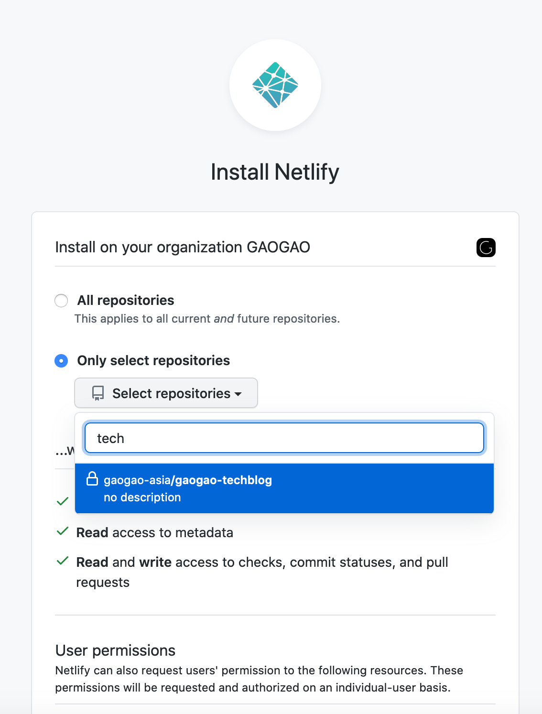
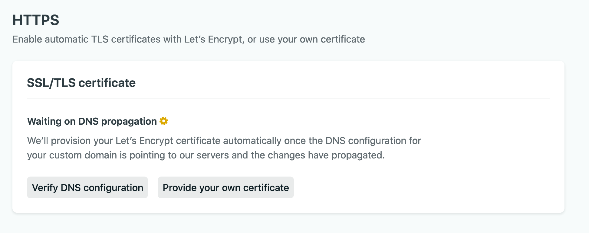
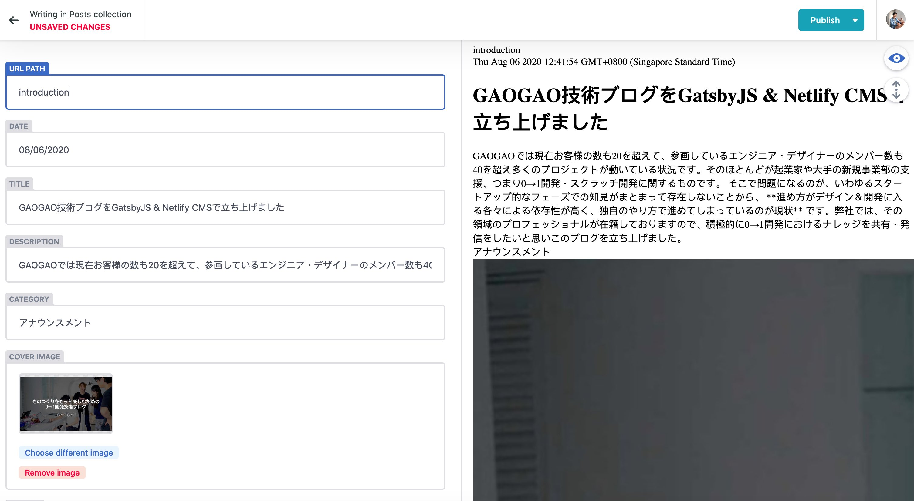

どうもどうも[GAOGAO](https://gaogao.asia) というスタートアップスタジオの代表をしておりますシンガポール在住の [@tejitak](https://twitter.com/tejitak) です。最近の趣味は自炊した写真をInstagramに上げることです。

# ガオラボという技術ブログを立ち上げた背景

GAOGAOでは現在お客様の数も20を超えて、参画しているエンジニア・デザイナーのメンバー数も40を超え多くのプロジェクトが動いている状況です。そのほとんどが起業家や大手の新規事業部の支援、つまり0→1開発・スクラッチ開発に関するものです。

そこで問題になるのが、いわゆるスタートアップ的なフェーズでの知見がまとまって存在しないことから、 **進め方がデザイン＆開発に入る各々による依存性が高く、独自のやり方で進めてしまっているのが現状** です。弊社では、その領域のプロフェッショナルが在籍しておりますので、積極的に0→1開発におけるナレッジを共有・発信をしたいと思いこのメディア **ガオラボ** を立ち上げました🎉 


# 技術選定は Gatsby + Netlify CMSに決定

ブログのホスティングといえばまずはWordpressが思い浮かぶかと思いますが、最近はnotionやStudioなどノーコードに関連したサービスや、Hugo/Gatsby/Hexoに代表されるようなSSG(Static Site Generator)を活用したブログのホスティングも増えてきています。
今回は **Gatsby + Netlify** を採択し、セットアップしました。

選択の理由

* 「マークダウンでかける x シンプルで良い x パフォーマンスが高い」を満たした
* Static Site Generatorとして人気が高くテンプレートも多い
* 見た目をJS/Reactでカスタマイズできる
* Netlify CMSと連携することでマークダウンによる投稿を管理画面ベースで実現できる（裏で自動でgithubにcommitされるStaticファイルが生成される）

結果、SSGセットアップしてこのサイトを使ってみると、サクサク動いて満足度高いブログが出来上がりました!

### gatsby-starter-hero-blog の利用

[gatsby-starter-hero-blog](https://github.com/greglobinski/gatsby-starter-hero-blog) こちらのテーマを使いGatsbyをセットアップしました。

実は初めのセットアップにはGatsby公式にあるテーマ [gatsby-starter-blog](https://www.gatsbyjs.org/starters/gatsbyjs/gatsby-starter-blog/) を利用していたが、UIがあまりにも質素だったため変更。

# セットアップの方法

以下、もう少し具体的にセットアップの方法を記述します。

### gatsby-cli をインストール

```sh
npm install -g gatsby-cli
```

### gatsby newを実行

```sh
gatsby new gaogao-techblog https://github.com/greglobinski/gatsby-starter-hero-blog.git
```

### サイト情報更新

`content/meta/config.js` 内のサイトタイトルや説明文などを適宜編集

### 不必要なメニューなどの削除

デフォルトではお問い合わせページなどいくつかのページが存在するが不要なので、`src/components/Menu/Menu.js` 内から不要な項目を削除。また `content/pages` 以下の固定ページも自動で読み込んでくれる機能があるようなので、pagesフォルダ以下のファイルを合わせて削除。

### Netlify CMSプラグインの導入

Netlify CMSを利用するためのプラグインをインストール

```sh
yarn add gatsby-plugin-netlify-cms netlify-cms-app
```

`gatsby-config.js` 内の `plugins` の配列に以下一行足す。

```sh
`gatsby-plugin-netlify-cms`
```

あとは後述するnetlifyとgithubを紐付ける設定を行うだけでCMS上での投稿もしくはgitによるpushをトリガーに自動で反映してくれます。

### OGP周りの設定

OGPのデフォルト画像を `static/preview.jpg` に配置。
また、各投稿のOGP画像は各マークダウン内の上部にあるメタデータフィールド `cover` で画像ファイル名を指定すればOKです。

例

```md
---
path: test1
date: 2020-08-03T08:04:09.331Z
title: テスト投稿2 from CMS
category: test
description: ogp用の説明文です
cover: cover.png
author: tejitak
---
```

# Netlifyへデプロイ

基本公式ドキュメントの以下のURL通り沿ってデプロイを進めていきます。

https://www.gatsbyjs.org/docs/sourcing-from-netlify-cms/

以下異なる点を少し記述します。

### Netlify CMS用の設定ファイル

Netlify CMS用の設定ファイル `static/admin/config.yml` は今回利用したテーマ `gatsby-starter-hero-blog` に合う出力をするように以下のように設定

```yml
backend:
  name: github
  repo: gaogao-asia/gaogao-techblog

media_folder: static/media
public_folder: /media
collections:
  - name: posts
    label: Posts
    label_singular: 'Post'
    folder: content/posts
    slug: "{{year}}-{{month}}-{{day}}--{{path}}"
    path: '{{slug}}/index'
    media_folder: ''
    public_folder: ''
    create: true
    fields:
      - { name: path, label: 'URL Path' }
      - { name: date, label: Date, widget: date }
      - { name: title, label: Title }
      - { name: description, label: Description }
      - { name: category, label: Category }
      - { name: cover, label: 'Cover Image', widget: 'image' }
      - { name: author, label: Author }
      - { name: body, label: Body, widget: markdown }
```

### Githubでの設定

GAOGAOのOrganizationのプライベートリポジトリに `gaogao-techblog` を作成。
投稿できるユーザーはリポジトリへの書き込み権限がある必要があります。

アプリケーションもOrganization内で作る必要があります。



### Netlifyの設定

Netlifyからの書き込みを許可する範囲の指定はOrganizationから該当リポジトリを選択。



### Netlify上でDNS設定を行う

Netlify自身がネームサーバー機能を提供しているようでしたが、GAOGAOのドメインは別ネームサーバーを利用しているので、DNSのレコードをそちら側に追加する形で設定を行いました。

SSL設定も自動で行ってくれます。



# 投稿の仕方

### 前提

該当リポジトリに書き込みできるgithubアカウントがある必要があります。

### Netlify CMSを使った投稿方法

1. `https://{your-blog-url}/admin/` にアクセス
2. githubアカウントで認証
3. **New Post** をクリックする
4. **Publish now** をクリックする（自動でnetlifyデプロイが走る）



こんな感じのエディタです。マークダウン モードとリッチエディターモードがあります。画像の挿入にはリッチエディタモードに切り替えて行うのがおすすめです。

### ローカルGatsby環境で投稿して反映する方法

上記のNetlify CMSを使わなくても手元で慣れている人はローカルGatsby環境を作って投稿することも可能です。

1. `npm install -g gatsby-cli` でgatsby cliをインストール
2. リポジトリをgit cloneする
3. 投稿用のフォルダを `content/posts` 以下に設置
   フォルダ名は `{yyyy}-{MM}-{dd}--{path}` にする。
   e.g. `content/posts/2020-08-03--test1`
4. `index.md` を作成
   画像などは同じフォルダ内に配置してマークダウンで読み込めます
5. `gatsby develop` を実行して `http://localhost:8000/` にアクセスして表示を確認できます
6. `git commit` ＆ `git push` を masterブランチに行います（自動でnetlifyデプロイが走る）

# 注意点

* githubのリポジトリアクセス権限がないといけないです (Netlify CMSの認証もgithubのOAuth前提で作られています)
* 更新時にmasterに変更がcommitされるが、反映までビルドに時間が少々かかる（パフォーマンスTips後述）
* Gatsbyのpostcssのプラグイン `gatsby-plugin-styled-jsx-postcss` がメンテナンスされていないらしく、最新モジュールだとNetlify上のビルドでフリーズしてしまいます。なので最新に上げることができないのがネック。詳細はこちらのissueに。https://github.com/gatsbyjs/gatsby/issues/21885

### Performance Tips

* キャッシュによるパフォーマンス改善Tips\

  <https://blog.ojisan.io/gatsby-meet-netlify>

  確かにビルドが速くなりました! [@sadnessOjisan](https://twitter.com/sadnessOjisan) ありがとうございます!

### まとめ

いかがでしたでしょうか。今回はGAOGAOの技術ブログの公開アナウンスメントとGatsby + NetlifyCMSを利用したセットアップについてお話ししました。

これからGAOGAOの各メンバーが0->1開発の情報を発信していきますので乞うご期待!