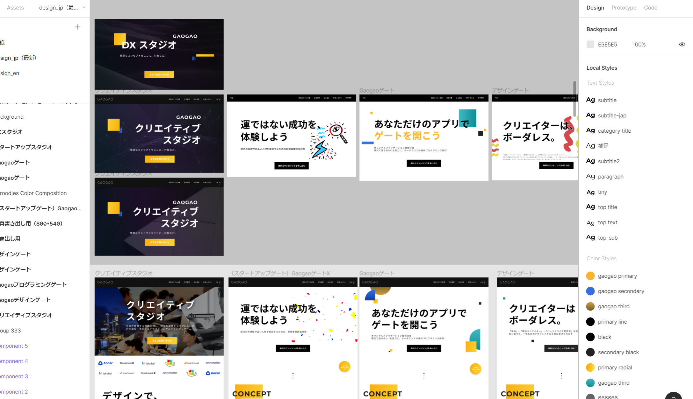
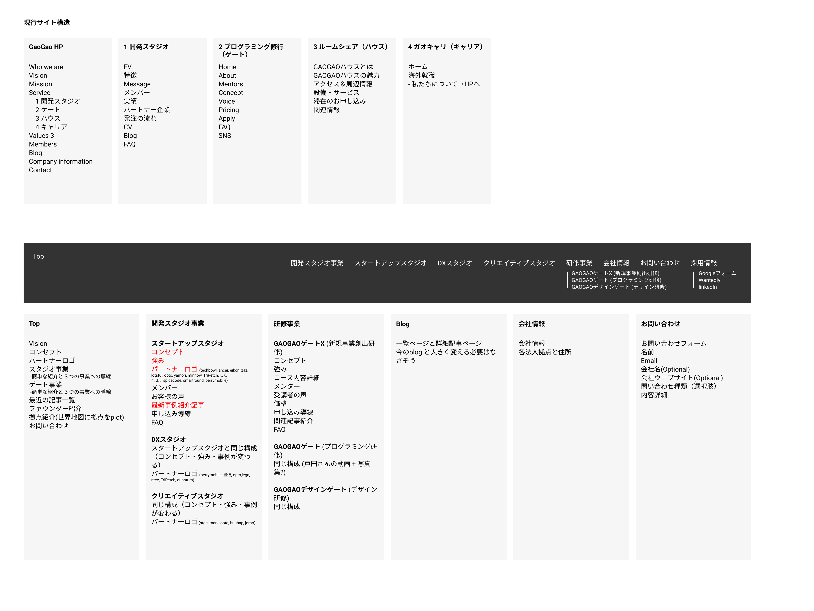
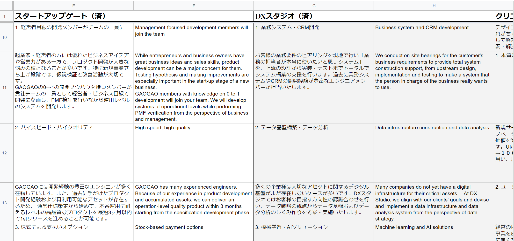

<!--StartFragment-->

こんにちは！UI/UXデザイナーのれいこ（@Reiko_Design）です。

2020年の6月、GAOGAO（<https://gaogao.asia/>）のウェブサイトをリニューアルする機会をいただきました。

デザイナーになりたての若造がどうやってウェブサイトをリニューアルしたのか、リニューアルの過程で得た学びや反省を記録に残しておこうと、ウェブサイトリニューアルの奮闘をまとめました。

経験の浅くて自信が持てないデザイナーや、これからサイトリニューアルをするけど何からすればいいかわからない！どういう落とし穴があるのか？などと悩んでいる方の参考になれば嬉しいです。

### 目次

* 背景（サイトリニューアルの要件）
* スケジュール
* 各タスクの進行
* タスク一覧
* ハプニング
* 翻訳
* まとめ

#### GAOGAOウェブサイトをデザインするに至った背景

私のデザイナーとしての自己紹介も兼ねて、GAOGAOとのご縁から振り返ります。

私は2019年中旬にCocoda!というサービスを介して独学でUIデザインとウェブデザインの勉強を始めました。

2019年の末ごろになるとデザイナーとして仕事の実績を積みたいなと思いはじめますが、過去の実績がないと仕事をいただけない、でも仕事がないと実績も作れないというジレンマに陥っていました。

そんな時に出会ったのが、東南アジアでエンジニアを育成するGAOGAOでした。創業者のKenさんとtejiさんはパワフルで懐深く、かつ私の大好きな東南アジアで活躍されています。そんな二人が運営するGAOGAOにとてもとても魅力を感じ、ついつい（高望みとは思いつつ）「いつか一緒に仕事したい」という想いを率直に伝えてしまいました。

すると、なんといきなり私に案件を任せてくださることに！まだ駆け出しのデザイナーで実績も何もない私を迷いもなく受け入れてくれたGAOGAOのみなさんには感謝してもしきれません。この好機を無下にはできないと、いつもより奮起してリニューアルに臨むことになります。

2020年5月12日、ウェブサイトリニューアルのキックオフミーティングを行いました。メンバーはエンジニアが３名、GAOGAO創立者のtejiさん、KenさんてベテランデザイナーでGAOGAOデザインゲートを運営するpolyさんという顔ぶれでした。

このミーティングで全体のスケジュールや、背景情報を共有し、成果物の期待値合わせを行ってプロジェクトスタートです。

#### スケジュール

5月12日にキックオフミーティングをしてから、約１カ月強かけてウェブサイトをリニュアルしていきます。進捗確認のミーティングは２週間に一回、それ以外の確認事項はslackで随時確認していく運営です。

#### タスクの進行方法

最初のキックオフミーティングで「誰が・何を・いつまでにするのか」を明確にしておいたので、後は各自で作業を進めます。

マイクロマネジメントではなく、完全に各自がやるべきことをやるべき時までにすませるやりかたで、とても仕事しやすい環境でした。

私は集中すると一気に作業を進められる一方で、気が乗らないといつまでも手を付けられないので、与えられた時間内で自分が集中できる時間とタイミングで仕事できる状況はとても働きやすい環境でした。

先に記載した通り、チームのメンバーとの進捗共有は２週間に一回行いました。誰が何をいつまでに行うかを整理し、認識をすり合わせて次の２週間に臨みます。

ミーティングは隔週でしたが、不明な点や確認事項が出てきた場合は適宜slackで質問・確認・依頼できる環境が整っていたので、とてもスムーズに進められたと思います。

#### タスク一覧

キックオフミーティング後にまず私の行うタスクを整理しました。

大雑把なタスクを時系列で並べると以下の通りです。

* 載せる情報の全体像整理
* 既存サイトとの関係性整理
* 情報の取捨選択
* ワイヤー作成
* 各ページの文章整理
* デザイン肉付け
* プロフィール写真用意
* プロフィール文言用意
* トップ画デザイン選定（複数パターンから選んでもらう）
* キャッチフレーズ決定
* 翻訳
* 開発

  

今回は日本語サイトのリニューアルに加え、英語のサイトも同時に公開するということでしたので、デザインと文言が決定してからコンテンツを英語に翻訳していきました。

各タスクの詳細は、長くなるので別記事で紹介します。⇒リンク

#### ハプニング

どんなプロジェクトにも、多かれ少なかれ何かしらのハプニングがつきものだと思います。今回も例にもれず、ちょっとしたトラブルがありました。

ウェブサイトリニューアルの時期がコロナ真っ只中だったこと、また東南アジア各国にメンバーが散らばっていたこともあり、メンバー全員で統一した写真が取れなかったことが一つの心残りです。

苦肉の策として、zoomの背景を同じ画像に設定し、同じくらいの明るさで同じくらいの顔の大きさになるよう各々撮影してもらいましたが、やはり明るさや撮影環境、利用しているPCの違いによって背景の明るさや顔の割合にかなり変動がでてしまい、フォトショップで少し手を加えることに。

コロナが収まったら、明るいスタジオや野外でみんなで集まって写真を撮りたいですね！

#### 翻訳

デザインが終わり、コンテンツも決まったらいよいよ英語コンテンツの作成です。日本語のコンテンツをGoogleDocsに一覧にしてまとめていたので、一気に英語に翻訳していきます。翻訳自体はとても好きなので苦にはならないのですが、いかんせん技術的な話の翻訳に慣れておらず、専門用語の使い方や自然な言い回しに苦戦しました。

文字というのは不思議なもので、タイポやスペルミスはその文章を書いた本人から姿を隠すすべを身に着けているようです。

翻訳漏れや漢字ミス、スペルミスはあってはならないものですが、自分ではなかなか見つけにくいので、時間をおいて文字が私のことを忘れたころに何度もウェブサイトを読み返し、間違いを見つけたら随時更新して行こうと思います。（先日も1か所タイポを見つけました）。

#### まとめ

以上、駆け出しのデザイナーとして関わらせていただいたGAOGAOウェブサイトリニューアルの一部始終を簡単に記載しました。ここまで長文にお付き合いいただきありがとうございました。GAOGAO Pte.Ltd. に興味を持っていただけた方や、Reikoとデザインの仕事を一緒にしたいよ！！という方ががいらっしゃればお気軽にご連絡ください！！

（英語の記事もMediumに書く予定ですので、出したらまたこちらにリンクを貼りますね。）

<!--EndFragment-->