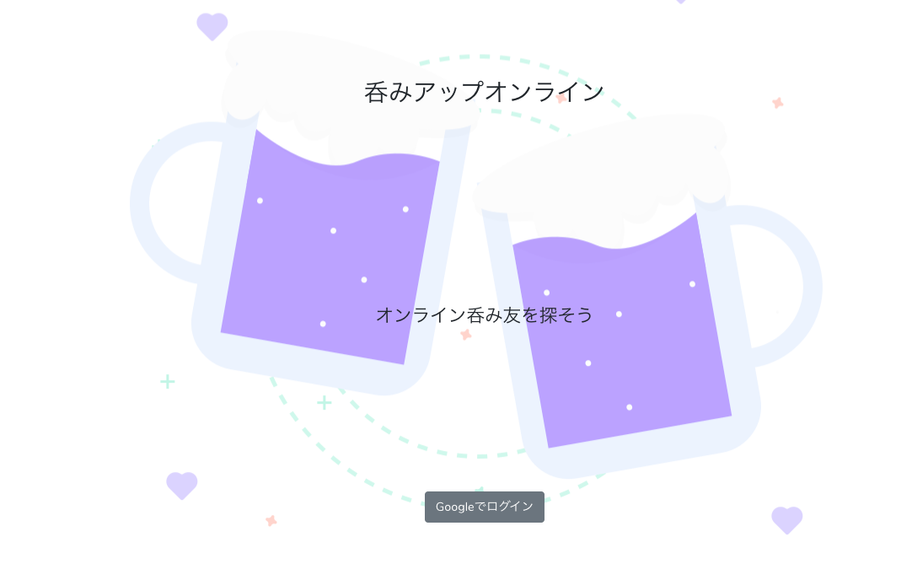
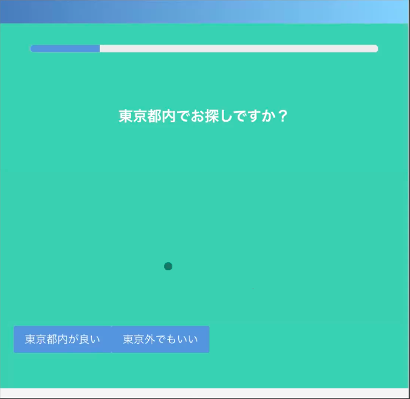
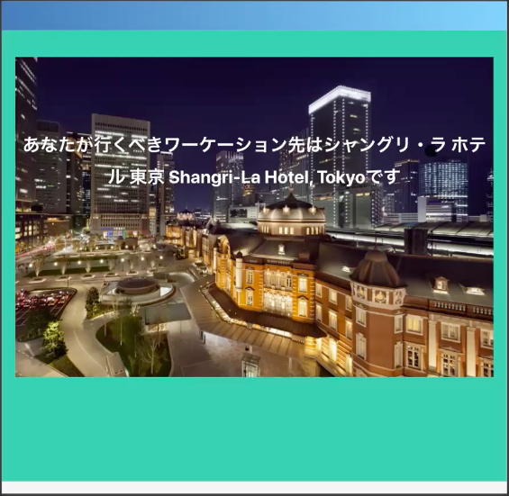
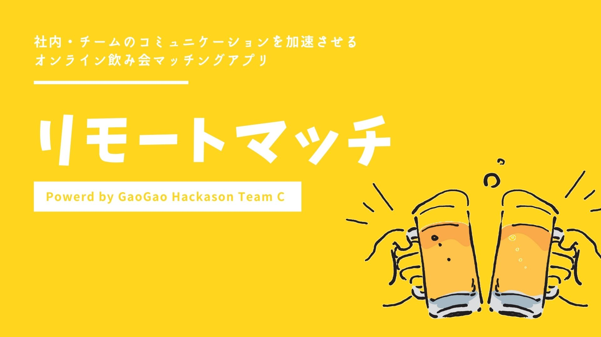
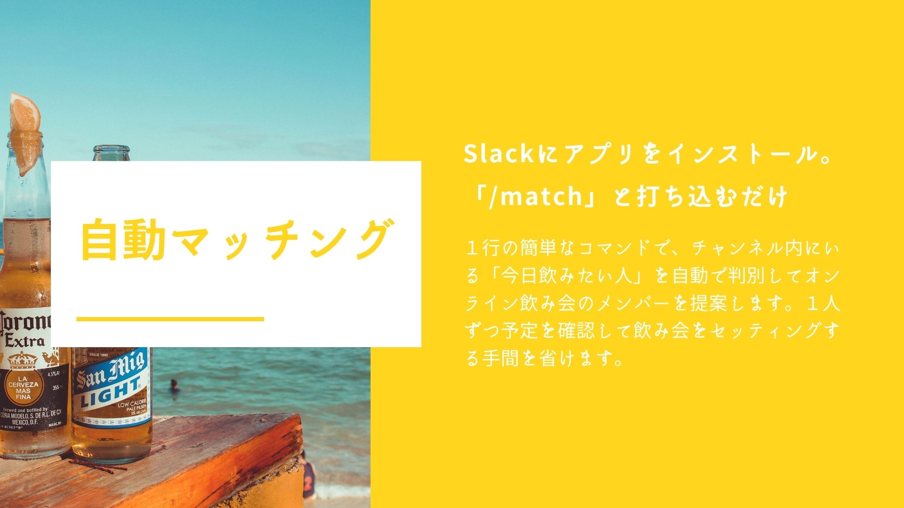
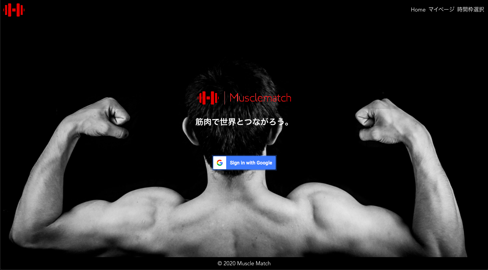
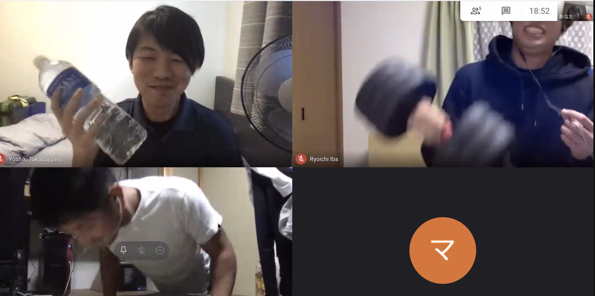
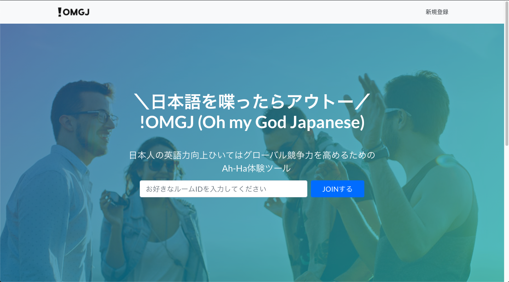
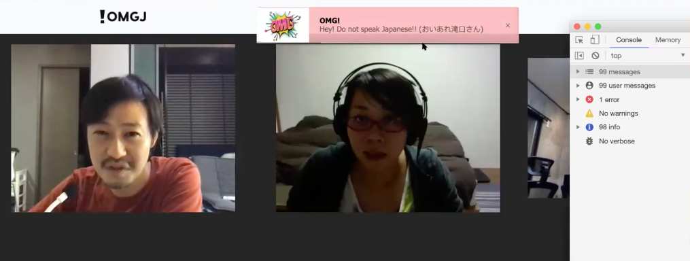

こんにちは、[GAOGAO](https://gaogao.asia/)にてエンジニアをしております [@masagao](https://twitter.com/masagaogaoasia) と申します。よろしくお願いいたします。

先日、第2回GAOGAO社内オンラインハッカソンの開催がありました。
前回同様、GAOGAO事業（スタートアップスタジオ/プログラミング研修/シェアハウス/ミートアップなど）で交流のあるメンバー同士でオンラインチームを組み、休日の丸一日間プログラミングをして成果物のお披露目をして競い合いました。
今回はその内容についてお話します。

## テーマ

### ハッカソンテーマ: 「withコロナを想定した価値のあるサービス」

コロナ不景気という未曾有の世界的な混乱が残る世間。この様なシチュエーションにおいて、どんな社会的価値を提供できているかをテーマに、チーム分けをして約一週間前から各チームが準備を始まりました。

### 当日のタイムスケジュール

* 11:00 ~ 11:30　オープニング・ルール説明
* 11:30 ~ 18:00　開発作業(休憩はチームで話し合い随時自由にとってください)
* 18:00 ~ 19:10　各チーム発表・質疑応答(1チーム10分から15分程度)
* 19:10 ~ 19:50　審査・表彰・総評
* 19:50 ~ 20:00　エンディング閉会
* 20:00 ~     　 希望者がいればオンライン飲み会(参加自由)

## 発表会

以下、各チームの発表内容を簡単にご紹介します。

###
・チーム1 ：「呑みアップオンライン」

オンライン飲み会をもっと気軽にできる体験できる様にしたサービス。
tinder like な UI で、男女関係なくすぐ呑める人とマッチングでき、Google Meetですぐに合流できるのがポイント。AuthはGoogleログインで実装しているため、利用時のハードルにも気が配れています。

また、チーム 1 はメンバーが[GAOGAOゲート](https://gaogao.asia/ja/gate/)の卒業生のチームでした。持ち前のチームワークを活かして1日でデプロイまで完了していて、発表時には、「いきなりハードルが上がった」との声も。

###
・チーム2 ：「ワーケーションサジェストアプリ」

コロナ禍で注目されている「ワーケーション」に着目したサービス。
「ワーケーション」とは、観光地やリゾート地で、休暇をとりながらリモートワークする働き方のことで、今回のチームメンバー全員がそれぞれ「ワーケーション」に興味があったためコンセプトに決定したとのことでした。\
\
サービス内容は「いくつかの質問に答えると、その人にあったワーケーション先をレコメンドしてくれる」というもので、レコメンドシステムは実際の現場でも求められるケースが増えているとのコメントも出てきて、こちらも高い評価をえていた様子でした。

### ・チーム3: 「リモートマッチ」

チーム3のサービスは、「社内チームのコミュニケーションを加速させる、オンライン飲み会マッチングアプリケーション」ということでした。Slack上から簡単に利用できる仕様になっており、リモートワーク化によるコミュニケーションの希薄化という問題を解決策を提供しています。\
\
具体的な使い方としては、slackにて「/match 人数」 とコマンド打ち込むことで、Slackの個人ステータスが「今日飲みたい人」に設定されている人同士を自動ランダムマッチングしてくれるというものでした。\
\
指定した人数の規模で、ランダムなマッチングが実行されるため、普段交流のない人との新しいコミュニケーションを提供できるはずとのことでした。

\
発表に対しては、予めコミュニティが形成されている Slack を用いているのが賢いと、アイディア面で高い評価を得ている様でした。

### ・チーム4: 「MuscleMatch」

こちらは、筋トレをしたい人同士がマッチングでき、Google Meet を利用して一緒に筋トレすることができるアプリケーションです。コロナ禍によって自宅時間が増え、筋力の低下や、運動の機会が減ってしまった方に向けたサービスになっています。

\
具体的な利用法としては、参加者はアプリを通じて用意された時間枠を選択し、部屋に参加。マッチングした利用者同士で筋トレした後、フィードバックを行ったり、ゲーミフィケーション要素としてポイントが付与される様になっているとのことでした。\

アイディア出しには Miro という Onlineホワイトボードツール を用いての ブレインストーミング をしたり、実装はチームメンバーが普段触らない技術をそれぞれ担当されたとのことで、チーム一丸となって楽しんで実装している様子が好印象でした。当日もみんなで筋トレする姿を見せるなど、とてもユーモアな発表でした。

### ・チーム5: 「OMGJ」

トリを務めるチーム5は、「日本人の英語力向上ひいては競争力を高めるためのAh-Ha体験ツール」というコンセプトで「OMGJ」というサービスを考案・実装しました。\
\
こちらは、Online 上のミーティングツールを利用して日本人同士で英語を話せる場所の提供と、音声検知によって日本語を話すとアプリ側に怒られてしまうことによるモチベーション管理機能を提供する様なサービス内容になっています。

\
今後の展開としては、Freeプランの他に、有料で英語講師の方に会話のログを採点してもらい、スピーキング指導してもらえる様な機能も追加していきたいとのことでした。\
\
発表時には実際に音声検知のデモも行われ、参加者の方々からは驚きにも似た歓声があがっていました。

## 表彰式
今回も非常にレベルの高いハッカソンとなり、わざわざ休日を使って参加していただいた方全員へ参加賞が渡されました。

- 参加賞：スタバ500円券 全員に贈呈

そして今回は、最優秀チームの他にも様々な賞が用意されており、
- ガオ丸賞：チーム1「呑みアップオンライン」
- アイディア賞：チーム3「リモートマッチ」
- パッション賞：チーム4「MuscleMatch」

がそれぞれ受賞する形になりました。そして映えある最優秀賞は、
- チーム5「OMGJ」

という結果になりました。やはり、音声検知の実装力や、今後の事業可能性等が高い評価を集め、高い評価を得るに繋がった印象です。

受賞者の皆さんには、それぞれ賞に応じた Amazonギフト券 が渡されました。また、今回結果が振るわなかった方々も、是非次回開催に向けてスキルアップを目指していっていただければと思います。

## 感想

実は、今回私は審査員側として参加させてただき、アイディア賞の授与等を決めさせていただくという形でハッカソンを見ていたのですが、みなさん1日で実装したとは思えないレベルで本当に驚きました。

是非次回は実装チーム側で参加したいと思ったので、第3回開催を心待ちにしております！
参加された皆さん本当にお疲れ様でした！

## 最後に

弊社GAOGAOは現在副業含めて30名以上のエンジニアの方が参画し、グローバル（シンガポール、バンコク、ホーチミン、US、日本など）で15件以上お客様の開発のお手伝いをさせていただいております。

もし、グローバルでスキルを試してみたいというエンジニアの方(デザイナーの方も)いましたらお気軽に [@tejitak](https://twitter.com/tejitak) までご連絡いただければ幸いです！世界中で「モノつくり」の連鎖を起こすことができる世界を実現するための仕組みを是非一緒に作っていきましょう！