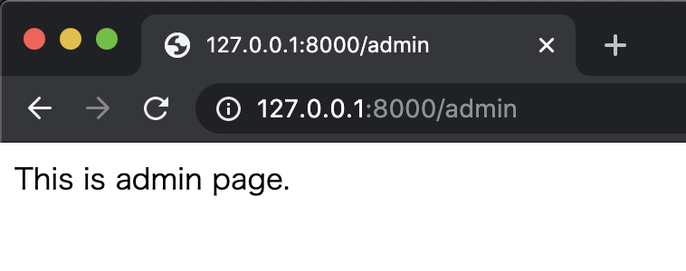

こんにちは、[GAOGAO](https://gaogao.asia/)にてスタートアップスタジオのエンジニアをしております [@mass-min](https://twitter.com/masumi_sugae) と申します。GAOGAOでは秀吉と呼ばれています。どうぞよろしくお願いいたします。

## Route定義ファイルの肥大化を防ぐ

Webアプリの開発を進めていくに従って、ページはどんどん増えていきます。最初はユーザーがアクセスする画面しかなかったアプリケーションも、管理画面が追加されたりAPIが生えたりしてrouteの肥大化が進みます。\
ということで今回は、Laravelを使ったアプリケーション開発において、route定義ファイルが肥大化し開発速度に影響を及ぼすことがないよう、適切に分ける方法をご紹介します。

## routes/web.phpを分割する

APIのパスは `routes/api.php` に書くのが良いでしょう。今回のケースでは、ユーザーがアクセスするパスと管理画面用のパスとでroute定義ファイルを分けることを考えます。

### 1. 管理画面用のroute定義ファイルを作成

管理画面用のrouteだけを定義するファイルを作成します。ユーザーがアクセスするページ用のroute定義ファイルが `web.php` なので、ここでは `webAdmin.php` という名前でファイルを作成します。

routes/webAdmin.php

```php
<?php

use Illuminate\Support\Facades\Route;

Route::get('/', function () {
    return 'This is admin page.';
});
```

### 2. サービスプロバイダにroute定義ファイルを登録

Laravel アプリケーションに route を登録するには、サービスプロバイダへの登録が必要になります。アプリケーションに登録されるサービスプロバイダは `config/app.php` に定義されていますから、このファイルを見てみましょう。

config/app.php

```php
<?php

return [

    /*
    |--------------------------------------------------------------------------
    | Application Name
    |--------------------------------------------------------------------------
    |
    | This value is the name of your application. This value is used when the
    | framework needs to place the application's name in a notification or
    | any other location as required by the application or its packages.
    |
    */

    'name' => env('APP_NAME', 'Laravel'),

    /*
    |--------------------------------------------------------------------------
    | Application Environment
    |--------------------------------------------------------------------------
    |
    | This value determines the "environment" your application is currently
    | running in. This may determine how you prefer to configure various
    | services the application utilizes. Set this in your ".env" file.
    |
    */

    'env' => env('APP_ENV', 'production'),

    /*
    |--------------------------------------------------------------------------
    | Application Debug Mode
    |--------------------------------------------------------------------------
    |
    | When your application is in debug mode, detailed error messages with
    | stack traces will be shown on every error that occurs within your
    | application. If disabled, a simple generic error page is shown.
    |
    */

    'debug' => (bool) env('APP_DEBUG', false),

    /*
    |--------------------------------------------------------------------------
    | Application URL
    |--------------------------------------------------------------------------
    |
    | This URL is used by the console to properly generate URLs when using
    | the Artisan command line tool. You should set this to the root of
    | your application so that it is used when running Artisan tasks.
    |
    */

    'url' => env('APP_URL', 'http://localhost'),

    'asset_url' => env('ASSET_URL', null),

    /*
    |--------------------------------------------------------------------------
    | Application Timezone
    |--------------------------------------------------------------------------
    |
    | Here you may specify the default timezone for your application, which
    | will be used by the PHP date and date-time functions. We have gone
    | ahead and set this to a sensible default for you out of the box.
    |
    */

    'timezone' => 'UTC',

    /*
    |--------------------------------------------------------------------------
    | Application Locale Configuration
    |--------------------------------------------------------------------------
    |
    | The application locale determines the default locale that will be used
    | by the translation service provider. You are free to set this value
    | to any of the locales which will be supported by the application.
    |
    */

    'locale' => 'en',

    /*
    |--------------------------------------------------------------------------
    | Application Fallback Locale
    |--------------------------------------------------------------------------
    |
    | The fallback locale determines the locale to use when the current one
    | is not available. You may change the value to correspond to any of
    | the language folders that are provided through your application.
    |
    */

    'fallback_locale' => 'en',

    /*
    |--------------------------------------------------------------------------
    | Faker Locale
    |--------------------------------------------------------------------------
    |
    | This locale will be used by the Faker PHP library when generating fake
    | data for your database seeds. For example, this will be used to get
    | localized telephone numbers, street address information and more.
    |
    */

    'faker_locale' => 'en_US',

    /*
    |--------------------------------------------------------------------------
    | Encryption Key
    |--------------------------------------------------------------------------
    |
    | This key is used by the Illuminate encrypter service and should be set
    | to a random, 32 character string, otherwise these encrypted strings
    | will not be safe. Please do this before deploying an application!
    |
    */

    'key' => env('APP_KEY'),

    'cipher' => 'AES-256-CBC',

    /*
    |--------------------------------------------------------------------------
    | Autoloaded Service Providers
    |--------------------------------------------------------------------------
    |
    | The service providers listed here will be automatically loaded on the
    | request to your application. Feel free to add your own services to
    | this array to grant expanded functionality to your applications.
    |
    */

    'providers' => [

        /*
         * Laravel Framework Service Providers...
         */
        Illuminate\Auth\AuthServiceProvider::class,
        Illuminate\Broadcasting\BroadcastServiceProvider::class,
        Illuminate\Bus\BusServiceProvider::class,
        Illuminate\Cache\CacheServiceProvider::class,
        Illuminate\Foundation\Providers\ConsoleSupportServiceProvider::class,
        Illuminate\Cookie\CookieServiceProvider::class,
        Illuminate\Database\DatabaseServiceProvider::class,
        Illuminate\Encryption\EncryptionServiceProvider::class,
        Illuminate\Filesystem\FilesystemServiceProvider::class,
        Illuminate\Foundation\Providers\FoundationServiceProvider::class,
        Illuminate\Hashing\HashServiceProvider::class,
        Illuminate\Mail\MailServiceProvider::class,
        Illuminate\Notifications\NotificationServiceProvider::class,
        Illuminate\Pagination\PaginationServiceProvider::class,
        Illuminate\Pipeline\PipelineServiceProvider::class,
        Illuminate\Queue\QueueServiceProvider::class,
        Illuminate\Redis\RedisServiceProvider::class,
        Illuminate\Auth\Passwords\PasswordResetServiceProvider::class,
        Illuminate\Session\SessionServiceProvider::class,
        Illuminate\Translation\TranslationServiceProvider::class,
        Illuminate\Validation\ValidationServiceProvider::class,
        Illuminate\View\ViewServiceProvider::class,

        /*
         * Package Service Providers...
         */

        /*
         * Application Service Providers...
         */
        App\Providers\AppServiceProvider::class,
        App\Providers\AuthServiceProvider::class,
        // App\Providers\BroadcastServiceProvider::class,
        App\Providers\EventServiceProvider::class,
        App\Providers\RouteServiceProvider::class,

    ],

    /*
    |--------------------------------------------------------------------------
    | Class Aliases
    |--------------------------------------------------------------------------
    |
    | This array of class aliases will be registered when this application
    | is started. However, feel free to register as many as you wish as
    | the aliases are "lazy" loaded so they don't hinder performance.
    |
    */

    'aliases' => [

        'App' => Illuminate\Support\Facades\App::class,
        'Arr' => Illuminate\Support\Arr::class,
        'Artisan' => Illuminate\Support\Facades\Artisan::class,
        'Auth' => Illuminate\Support\Facades\Auth::class,
        'Blade' => Illuminate\Support\Facades\Blade::class,
        'Broadcast' => Illuminate\Support\Facades\Broadcast::class,
        'Bus' => Illuminate\Support\Facades\Bus::class,
        'Cache' => Illuminate\Support\Facades\Cache::class,
        'Config' => Illuminate\Support\Facades\Config::class,
        'Cookie' => Illuminate\Support\Facades\Cookie::class,
        'Crypt' => Illuminate\Support\Facades\Crypt::class,
        'DB' => Illuminate\Support\Facades\DB::class,
        'Eloquent' => Illuminate\Database\Eloquent\Model::class,
        'Event' => Illuminate\Support\Facades\Event::class,
        'File' => Illuminate\Support\Facades\File::class,
        'Gate' => Illuminate\Support\Facades\Gate::class,
        'Hash' => Illuminate\Support\Facades\Hash::class,
        'Http' => Illuminate\Support\Facades\Http::class,
        'Lang' => Illuminate\Support\Facades\Lang::class,
        'Log' => Illuminate\Support\Facades\Log::class,
        'Mail' => Illuminate\Support\Facades\Mail::class,
        'Notification' => Illuminate\Support\Facades\Notification::class,
        'Password' => Illuminate\Support\Facades\Password::class,
        'Queue' => Illuminate\Support\Facades\Queue::class,
        'Redirect' => Illuminate\Support\Facades\Redirect::class,
        'Redis' => Illuminate\Support\Facades\Redis::class,
        'Request' => Illuminate\Support\Facades\Request::class,
        'Response' => Illuminate\Support\Facades\Response::class,
        'Route' => Illuminate\Support\Facades\Route::class,
        'Schema' => Illuminate\Support\Facades\Schema::class,
        'Session' => Illuminate\Support\Facades\Session::class,
        'Storage' => Illuminate\Support\Facades\Storage::class,
        'Str' => Illuminate\Support\Str::class,
        'URL' => Illuminate\Support\Facades\URL::class,
        'Validator' => Illuminate\Support\Facades\Validator::class,
        'View' => Illuminate\Support\Facades\View::class,

    ],

];
```

137行目からの配列がアプリケーションに登録されるサービスプロバイダの一覧です。この中で176行目に`App\Providers\RouteServiceProvider::class` が定義されています。これがrouteを司るサービスプロバイダです。ファイルを見てみましょう。

app/Providers/RouteServiceProvider.php 

```php
<?php

namespace App\Providers;

use Illuminate\Cache\RateLimiting\Limit;
use Illuminate\Foundation\Support\Providers\RouteServiceProvider as ServiceProvider;
use Illuminate\Http\Request;
use Illuminate\Support\Facades\RateLimiter;
use Illuminate\Support\Facades\Route;

class RouteServiceProvider extends ServiceProvider
{
    /**
     * The path to the "home" route for your application.
     *
     * This is used by Laravel authentication to redirect users after login.
     *
     * @var string
     */
    public const HOME = '/home';

    /**
     * Define your route model bindings, pattern filters, etc.
     *
     * @return void
     */
    public function boot()
    {
        $this->configureRateLimiting();

        $this->routes(function () {
            Route::prefix('api')
                ->middleware('api')
                ->group(base_path('routes/api.php'));

            Route::middleware('web')
                ->group(base_path('routes/web.php'));
        });
    }

    /**
     * Configure the rate limiters for the application.
     *
     * @return void
     */
    protected function configureRateLimiting()
    {
        RateLimiter::for('api', function (Request $request) {
            return Limit::perMinute(60);
        });
    }
}
```

Laravelの各サービスプロバイダのbootメソッドは、全てのサービスプロバイダを登録し終えた後に呼び出されます。したがって、このサービスプロバイダの `$this->routes();` のコールバック function に Route を渡してあげればOKです。以下のような感じ。

app/Providers/RouteServiceProvider.php (bootメソッドのみ)

```php
<?php
    /**
     * Define your route model bindings, pattern filters, etc.
     *
     * @return void
     */
    public function boot()
    {
        $this->configureRateLimiting();

        $this->routes(function () {
            Route::prefix('api')
                ->middleware('api')
                ->group(base_path('routes/api.php'));

            Route::middleware('web')
                ->group(base_path('routes/web.php'));
          
            Route::prefix('admin')
                ->middleware('web')
                ->group(base_path('routes/webAdmin.php'));
        });
    }
```

middleware群は `route/web.php` に適用されるものと同じものを適用しつつ、新たに作成したroute定義ファイル(`route/webAdmin.php`)を読み込み、パスにプレフィックスとして `admin` を付けるよう設定を変更しました。試しにrouteを確認してみましょう。

```shell
$ php artisan route:list
+---------+-------------+-----------+-------+---------+--------------+
| Domain | Method     | URI          | Name | Action | Middleware |
+---------+-------------+-----------+-------+---------+--------------+
|               | GET|HEAD | /             |           | Closure | web            |
|               | GET|HEAD | admin     |           | Closure | web            |
|               | GET|HEAD | api/user |           | Closure | api              |
|               |                   |                 |          |               | auth:api     |
+---------+-------------+-----------+-------+---------+--------------+
```

adminのパスが追加されています。アクセスすると、ちゃんとroute定義ファイルに設定した文字が表示されています。



ちなみにwebとは違うmiddleware群を設定したい場合は、 `app/Http/Kernel.php` の `$middlewareGroups` に新しくmiddleware群を定義してあげればOKです。adminページ全体にベーシック認証を掛けたい場合なんかに使えますね！

## 最後に

弊社GAOGAOは現在副業含めて30名以上のエンジニアの方が参画し、グローバル（シンガポール、バンコク、ホーチミン、US、日本など）で15件以上お客様の開発のお手伝いをさせていただいております。

もし、グローバルでスキルを試してみたいというエンジニアの方(デザイナーの方も)いましたらお気軽に [@tejitak](https://twitter.com/tejitak) までご連絡いただければ幸いです！世界中で「モノつくり」の連鎖を起こすことができる世界を実現するための仕組みを是非一緒に作っていきましょう！

## 参考

[Laravel 8.x サービスプロバイダ](https://readouble.com/laravel/8.x/ja/providers.html)

\[[Laravel]ルーティングファイルを分割して管理する](https://qiita.com/hiro5963/items/5e533fe014f29f636a3d)\
[Laravel本体の認証機能とは別にDB情報を使わないbasic認証を実装するサンプル](https://qiita.com/fumiyasac@github/items/cdf854008e7487148a67)[](https://qiita.com/tags/%e3%83%ab%e3%83%bc%e3%83%86%e3%82%a3%e3%83%b3%e3%82%b0)