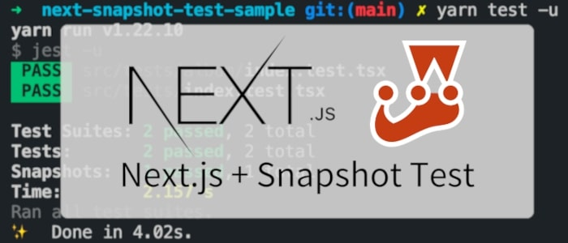
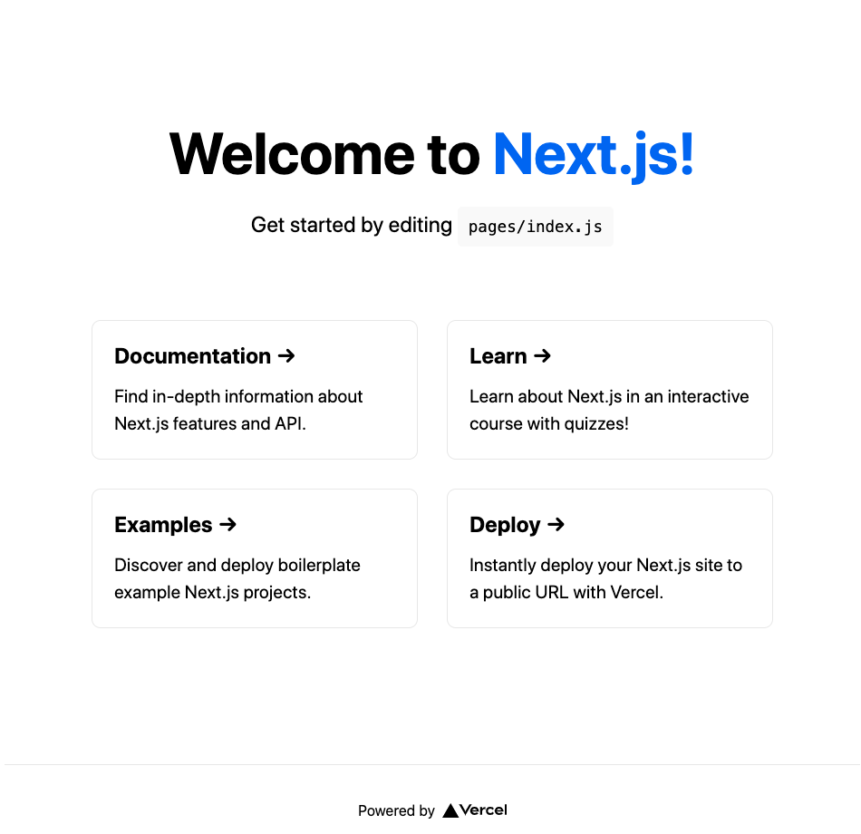
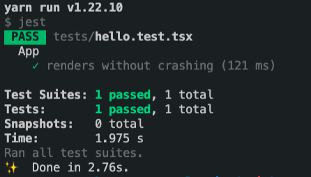
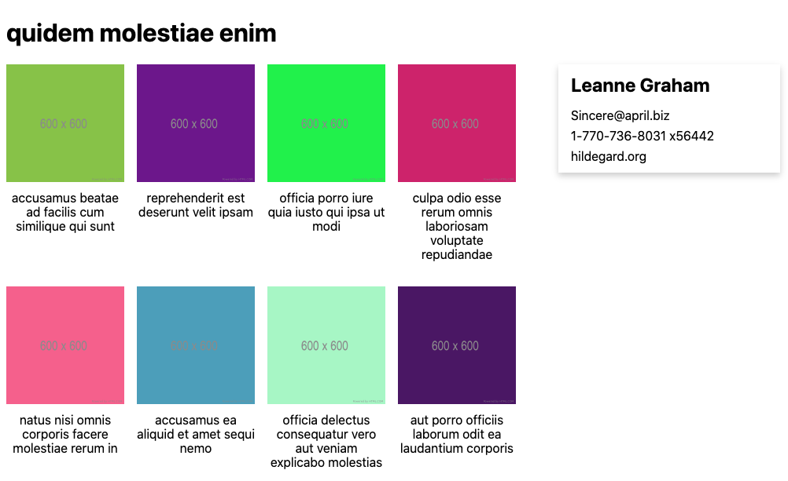
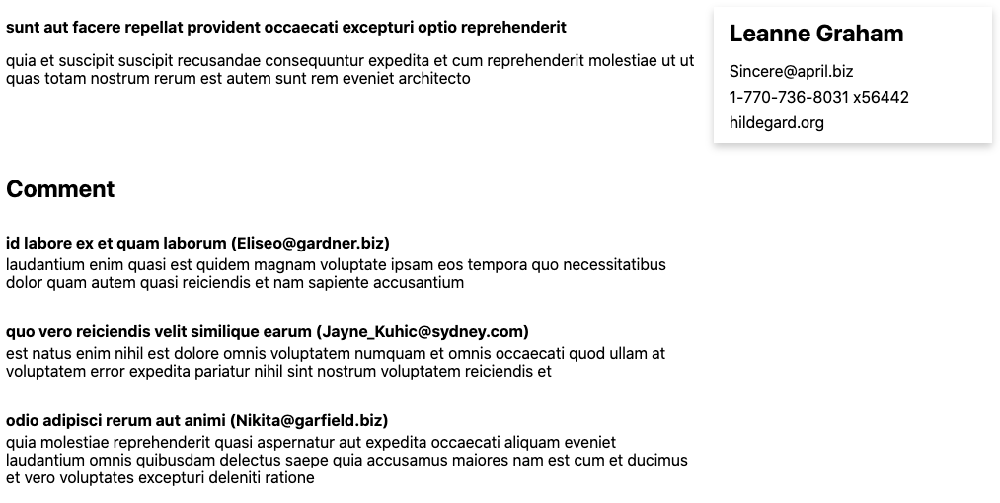
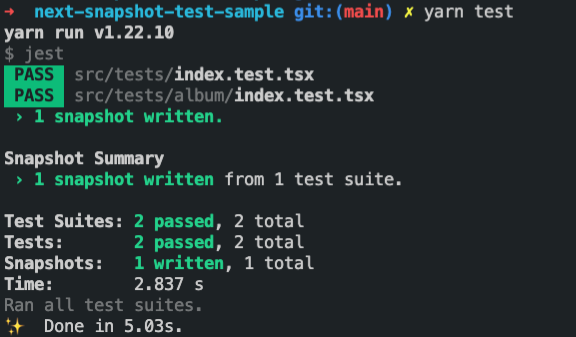
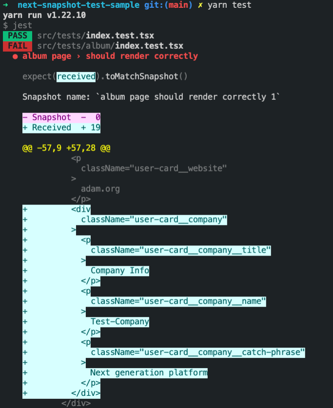

こんにちは。 [GAOGAO](https://gaogao.asia/) に所属しております [@kourin](https://twitter.com/Kourin1996) と申します。宜しくお願いいたします。
この記事では、Next.js のスナップショットテストについて説明します。

## まえがき

[Next.js](https://nextjs.org/) は [React](https://reactjs.org/) 向けに サーバーサイドレンダリング (SSR) や 静的サイト生成(SSG) を可能にするフレームワークで、React を使ったWebアプリ開発プロジェクトで Next.js を使う機会が増えてきています。

React, Next.js で開発をしていると、コンポーネントの修正時に意図していない別のページの内容まで変化してしまうことがあります。プロジェクトが大規模化するにつれて、共有コンポーネントが増えていき、コンポーネント修正時に変化する部分を補足することが難しくなります。このような場合にスナップショットテストが有効です。スナップショットテストでは、テスト実行時にコンポーネントを構築し、その中身が前回のテスト時と同じかどうかをチェックします。スナップショットテストを行うことで、コンポーネントを修正した際に、その修正がどのコンポーネントに影響を及ぼしているかを容易に確認することができます。

この記事では、Reactのテストで使われている [jest](https://jestjs.io/) や [React Testing Library](https://github.com/testing-library/react-testing-library) と、Next.js のページをテストで扱えるようにする [next-page-tester](https://github.com/toomuchdesign/next-page-tester) というライブラリを組み合わせることで、ページ単位でスナップショットテストを行う方法について解説します。

サンプルコードは https://github.com/Kourin1996/next-snapshot-test-sample にあります。

## プロジェクト構築

まず、Next.js のプロジェクトとそのテスト環境を構築します。

### Next.js + TypeScriptを導入

`npx create-next-app` コマンドを使って、Next.js のプロジェクトを新規作成します。

```bash
npx create-next-app next-snapshot-test-sample
```

<br />

`next-snapshot-test-sample` というディレクトリが作成され、その中に Next.js のプロジェクトが用意されます。  
`next-snapshot-test-sample` に移動し、TypeScript 関係のパッケージを追加します。

```bash
cd next-snapshot-test-sample
touch tsconfig.json
yarn add -D typescript @types/react @types/node
```

<br />

そして、`yarn dev` を実行し、ブラウザから `http://localhost:3000` にアクセスすると、画像のようなページが表示されます。

```bash
yarn dev
```



`next-snapshot-test-sample` ディレクトリの中には `pages` ディレクトリがあり、各ページ用のコンポーネントが置いてあります。
`src` ディレクトリをプロジェクトルート以下に作り、`src/pages`, `src/styles` となるように `pages`, `styles` ディレクトリを `src` ディレクトリの中に移動します。

### テスト環境導入

次に、テスト環境を導入します。必要なパッケージを追加します。

```bash
yarn add -D jest jest-dom @testing-library/react @testing-library/jest-dom @testing-library/dom babel-jest identity-obj-proxy react-test-renderer fetch-mock ts-jest @types/jest @types/react-test-renderer @types/fetch-mock
```

<br/>

`setupTests.js` を `next-snapshot-test-sample` 直下に作り、以下を記述します。

```js
import "@testing-library/jest-dom/extend-expect";
```

<br/>

`.babelrc` を `next-snapshot-test-sample` 直下に作り、以下を記述します。

```.babelrc
{
  "presets": ["next/babel"]
}
```

<br/>

`jest.config.js` を `next-snapshot-test-sample` 直下に作り、以下を記述します。

```js
module.exports = {
  testPathIgnorePatterns: ["<rootDir>/.next/", "<rootDir>/node_modules/"],
  setupFilesAfterEnv: ["<rootDir>/setupTests.js"],
  transform: {
    "^.+\\.(js|jsx|ts|tsx)$": "<rootDir>/node_modules/babel-jest",
  },
  moduleNameMapper: {
    "\\.(css|less)$": "identity-obj-proxy",
  },
};
```

<br/>

`package.json` の `scripts` にテスト用のスクリプトを追加します。

```json
{
  ...
  "scripts": {
    ...
    "test": "jest"
  },
}
```

<br/>

試しに簡単なテストを実行してみます。  
`src/tests` ディレクトリを作り、その中に`hello.test.tsx` を作成し、以下を記述します。
このテストは、`src/pages/index.tsx` で定義されているコンポーネントに、`Welcome to Next.js!` という内容が含まれていたらテストが成功します。

```tsx
import { render, screen } from "@testing-library/react";
import App from "../pages/index";

describe("App", () => {
  it("renders without crashing", () => {
    render(<App />);
    expect(
      screen.getByRole("heading", { name: "Welcome to Next.js!" })
    ).toBeInTheDocument();
  });
});
```

<br/>

`yarn test` を実行すると、テストが実行されます。 `PASS` と表示され、テストが成功します。

```.bash
yarn test
```



### next-page-tester 導入

次に、Next.js のページをテストで扱えるようにするためのライブラリである `next-page-tester` を導入します。  
パッケージを追加します。

```bash
yarn add -D next-page-tester
```

<br />

`setupTests.js` を修正して、以下のようにコードを追記します。

```js
import "@testing-library/jest-dom/extend-expect";
// 以下を追記
import { initTestHelpers } from 'next-page-tester';
initTestHelpers();
```

<br/>

`src/tests/index.test.tsx` を以下のように修正します。

```tsx
import { getPage } from "next-page-tester";
import { render, screen } from "@testing-library/react";

describe("index page", () => {
  test('should have "Welcome to"', async () => {
    const { render } = await getPage({
      route: "/",
    });

    render();
    expect(screen.getByText("Welcome to")).toBeInTheDocument();
  });
});
```

</br>

`yarn test` を実行し、テストが成功したら`next-page-tester` の導入は完了です。

```bash
yarn test
```

## next-page-tester 使い方

next-page-tester の簡単な使い方について説明します。

```ts
import { getPage } from "next-page-tester";
import { screen } from "@testing-library/react";

describe("Index page", () => {
  test("renders index page", async () => {
    const { page, render } = await getPage({
      route: "/",
    });

    render();
    expect(screen.getByText("Welcome to")).toBeInTheDocument();
  });
});
```

<br />

next-page-tester は src/pages 以下にあるページコンポーネントをテストで扱えるようにします。これらのコンポーネントでは, ファイル中に `getServerSideProps` 関数を定義することができます。この関数はサーバサイドで実行され、その結果が `props` としてコンポーネントに渡されます。next-page-tester は、テスト中に getServerSideProps を実行し、結果をコンポーネントに渡した上でテストが実行されます。

next-page-tester を使う際は、`getPage` 関数を呼び出します。引数の `route` にはテストしたいページのパスを指定します。上のテストの場合は、パスが `/` のページである `src/pages/index.tsx` のテストを行っています。

getPage 関数は `page` や `render` を返します。`page` はページのコンポーネントを返し、`render` は React Testing Library の render のようなもので、この関数を実行した後に、React Testing Libraryの `screen` などを使ってテストをすることができます。 

<br />

getServerSideProps で `fetch` を使って外部からデータを取得している場合には、エラーが発生しテストが失敗してしまうため、 `fetch-mock` を使って fetch 関数のモックを作ります。以下は fetch-mock を使ったテストコードのサンプルです。

```ts
import { getPage } from "next-page-tester";
import { screen } from "@testing-library/react";
import fetchMock from "fetch-mock"

describe("Index page", () => {
  beforeAll(() => {
    fetchMock.get("http://sample.hoge", { "name": "sample" })
  })

  test("renders index page", async () => {
    const { page, render } = await getPage({
      route: "/",
    });

    render();
    expect(screen.getByText("Welcome to")).toBeInTheDocument();
  });
});
```

```tsx
import React from "react"

const IndexPage: React.Page<{ name: string }> = (props) => {
  const { name } = props;
  return (
     <div>
     {`Welcome to ${name}`}
     </div>
  );
}

export const getServerSideProps = async () => {
  const res = await fetch("https://sample.hoge")
                    .then((res) => res.json());
  return { props: res };
};

export default Index;
```

fetch-mock では、呼ぶURLとそのURLが返すデータを渡します。サンプルコードでは、テスト中に `http://sample.hoge` というURLで fetch が呼ばれた場合に `{"name":"sample"}` というデータを返すように設定します。このようにすることで、 getServerSideProps の中で `fetch('http://sample.hoge')` が呼ばれた場合は `{"name":"sample"}` というデータを得ることができます。


## next-page-tester を使ったページのスナップショットテスト

それでは実際のコードを用いて、スナップショットテストの解説をしていきます。

### 作成するページ

今回は、2種類のページ `/album/[id]` と `/post/[id]` を作ります。各ページに表示される内容は、以下の画像の通りになっています。  
`album` では、パスで与えられたIDのアルバムのデータを取得し、タイトルと作成者情報、そしてアルバムに含まれる画像を表示します。  
`post` では、指定したIDの投稿データを取得し、タイトル、本文、投稿者情報、そして投稿に対するコメントを表示します。  
`album` と `post` では、作成者の情報を表示するコンポーネントが共通となっています。(スクリーンショットの右側のコンポーネント)





表示するデータは、ダミーデータを返す https://jsonplaceholder.typicode.com/ という既存のAPIから取得します。

### 各ページの実装

`album`, `post` ページ用のコンポーネントとユーザ情報を表示する共通のUIコンポーネントを追加します。

`src/pages/album/[id].tsx` を作成し、以下を記述します。

```tsx
import React from "react";
import { GetServerSideProps, NextPage } from "next";
import { User, Album, Photo } from "../../domain";
import { UserCard } from "../../components/UserCard";

type AlbumPageProps = {
  user: User;
  album: Album;
  photos: Photo[];
};

const AlbumPage: NextPage<AlbumPageProps> = (props) => {
  const { user, album, photos } = props;

  return (
    <div className="album__page">
      <h1>{album.title}</h1>
      <div className="album__body">
        <div className="album__body__list">
          {photos.map((photo) => {
            const { id, title, url } = photo;
            return (
              <div key={id} className="album__body__list__item">
                
                <p className="album__body__list__item__title">{title}</p>
              </div>
            );
          })}
        </div>
        <div className="album__body__author">
          <UserCard user={user} />
        </div>
      </div>
    </div>
  );
};

export const getServerSideProps: GetServerSideProps<AlbumPageProps> = async (
  context
) => {
  const id = Array.isArray(context.params["id"])
    ? context.params["id"][0]
    : context.params["id"];

  const [album, photos] = await Promise.all([
    fetch(`https://jsonplaceholder.typicode.com/albums/${id}`)
      .then((res) => res.json())
      .then(
        (data): Album => {
          if (Object.keys(data).length === 0) {
            throw new Error("Not Found");
          }
          return data;
        }
      ),
    fetch(`https://jsonplaceholder.typicode.com/albums/${id}/photos`)
      .then((res) => res.json())
      .catch(() => []),
  ]);
  const user = await fetch(
    `https://jsonplaceholder.typicode.com/users/${album.userId}`
  ).then((res) => res.json());

  return {
    props: {
      user,
      album,
      photos,
    },
  };
};

export default AlbumPage;
```

<br />

次に `src/pages/post/[id].tsx` を作成し、以下を記述します。

```tsx
import React from "react";
import { GetServerSideProps, NextPage } from "next";
import { User, Post, Comment } from "../../domain";
import { UserCard } from "../../components/UserCard";

type PostPageProps = {
  user: User;
  post: Post;
  comments: Comment[];
};

const PostPage: NextPage<PostPageProps> = (props) => {
  const { user, post, comments } = props;

  return (
    <div className="post__page">
      <div className="post__main">
        <div className="post__contents">
          <h1 className="post__main__post__title">{post.title}</h1>
          <p>{post.body}</p>
        </div>
        <div className="post__main__author">
          <UserCard user={user} />
        </div>
      </div>
      <div className="post__comments">
        <h2 className="post__comments__title">Comment</h2>
        {comments.map((comment) => {
          const { id, name, email, body } = comment;

          return (
            <div key={id} className="post__comments__comment">
              <p className="post__comments__comment__header">{`${name} (${email})`}</p>
              <p className="post__comments__comment__content">{body}</p>
            </div>
          );
        })}
      </div>
    </div>
  );
};

export const getServerSideProps: GetServerSideProps<PostPageProps> = async (
  context
) => {
  const id = Array.isArray(context.params["id"])
    ? context.params["id"][0]
    : context.params["id"];

  const [post, comments] = await Promise.all([
    fetch(`https://jsonplaceholder.typicode.com/posts/${id}`)
      .then((res) => res.json())
      .then((data) => {
        if (Object.keys(data).length === 0) {
          throw new Error("Not Found");
        }
        return data;
      }),
    fetch(`https://jsonplaceholder.typicode.com/posts/${id}/comments`)
      .then((res) => res.json())
      .catch(() => []),
  ]);
  const user = await fetch(
    `https://jsonplaceholder.typicode.com/users/${post.userId}`
  ).then((res) => res.json());

  return {
    props: {
      user,
      post,
      comments,
    },
  };
};

export default PostPage;
```

<br />

最後に `album` ページと `post` ページの両方で使用している、`UserCard` コンポーネントを追加します。  
`src/components/UserCard/index.tsx` を作成し、以下を記述します。

```tsx
import React from "react";
import { User } from "../../domain";

type UserCardProps = React.HTMLAttributes<HTMLDivElement> & {
  children?: never;
  user: User;
};

export const UserCard: React.FC<UserCardProps> = (props) => {
  const { user } = props;

  return (
    <div className="user-card">
      <p className="user-card__name">{user.name}</p>
      <p className="user-card__email">{user.email}</p>
      <p className="user-card__phone">{user.phone}</p>
      <p className="user-card__website">{user.website}</p>
    </div>
  );
};
```

### スナップショットテストを追加

次に `album` ページのスナップショットテストをするために、テストを追加します。

`src/tests/album/index.test.tsx` を追加し、以下を記述します

```tsx
import { getPage } from "next-page-tester";
import fetchMock from "fetch-mock";
import renderer from "react-test-renderer";

describe("album page", () => {
  beforeAll(() => {
    fetchMock
      .get("https://jsonplaceholder.typicode.com/albums/1", {
        id: 1,
        userId: 1,
        title: "Test Title",
      })
      .get("https://jsonplaceholder.typicode.com/albums/1/photos", [
        {
          id: 1,
          albumId: 1,
          title: "Test Photo",
          url: "/test.png",
          thumbnailUrl: "/test-thumbnail.png",
        },
        {
          id: 2,
          albumId: 1,
          title: "Test Photo2",
          url: "/test-2.png",
          thumbnailUrl: "/test-thumbnail-2.png",
        },
      ])
      .get("https://jsonplaceholder.typicode.com/users/1", {
        id: 1,
        name: "Adam",
        username: "adam1980",
        email: "adam@hoge.org",
        address: {
          street: "Kulas Light",
          suite: "Apt. 556",
          city: "Gwenborough",
          zipcode: "92998-3874",
          geo: {
            lat: "-37.3159",
            lng: "81.1496",
          },
        },
        phone: "1-770-736-8031 x56442",
        website: "adam.org",
        company: {
          name: "Test-Company",
          catchPhrase: "Next generation platform",
          bs: "photo",
        },
      });
  });

  test("should render correctly", async () => {
    const { page } = await getPage({
      route: "/album/1",
    });

    const tree = renderer.create(page).toJSON();
    expect(tree).toMatchSnapshot();
  });
});
```

上のテストでは、`/album/1` にアクセスした時のページに関して、スナップショットテストを行います。前回のテスト実行時と同じ内容が表示される場合はテストが成功します。(初回の場合、前回の結果が無いため必ず成功します)  

また、`beforeAll` の中で fetch 関数のモックを設定し、 getServerSideProps で fetch が呼ばれた場合、URLに対応するダミーデータを返すように設定します。  

`yarn test` を実行してみると、以下のような結果が得られます。  
初回のスナップショットテストなので、テストは成功し `x snapshot written` と表示されます。スナップショットテストをすると、テストのファイルと同じ階層に `__snapshots__` ディレクトリが自動で作成されます。このディレクトリの中には、次回のスナップショットテストで使うスナップショットのデータが入っているため、gitなどのバージョン管理システムの監視対象として追加します。



### UIコンポーネントの修正とスナップショットテストの実行

次に、`post` ページに表示されている作成者情報に、ユーザの企業情報も表示するように修正します。


`src/components/UserCard/index.tsx` を修正します。

```tsx
import React from "react";
import { User } from "../../domain";

type UserCardProps = React.HTMLAttributes<HTMLDivElement> & {
  children?: never;
  user: User;
};

export const UserCard: React.FC<UserCardProps> = (props) => {
  const { user } = props;

  return (
    <div className="user-card">
      <p className="user-card__name">{user.name}</p>
      <p className="user-card__email">{user.email}</p>
      <p className="user-card__phone">{user.phone}</p>
      <p className="user-card__website">{user.website}</p>
      <div className="user-card__company">
        <p className="user-card__company__title">Company Info</p>
        <p className="user-card__company__name">{user.company.name}</p>
        <p className="user-card__company__catch-phrase">
          {user.company.catchPhrase}
        </p>
      </div>
    </div>
  );
};
```

<br />

UserCard は、`album` ページでも使用しているコンポーネントのため、この修正により `album` ページの内容も変化してしまいます。そのため、`yarn test` でテストを再度行うと、以下のようにテストが失敗します。



テストの結果を見ると、ハイライトされている部分が企業情報の部分となっており、新たに追加した部分と対応していることが分かります。このように、コンポーネントを修正した事で、ページが前回のテストから変化したことが分かります。もしこの変化が意図するものであれば、`yarn test -u` を実行することで、スナップショットを更新することができます。

## まとめ

jest, React Testing Libray, next-page-tester を組み合わせることで、 Next.js のプロジェクトで getServerSideProps の実行も含めてページ単位でテストを行うことができます。スナップショットテストをページ単位で行うことで、コンポーネントの修正がどのページに影響を及ぼすかを容易に補足することができ、意図しない変化を防ぐことができるようになります。

## 最後に

弊社 GAOGAO は現在副業含めて30名以上のエンジニアの方が参画し、グローバル（シンガポール、バンコク、ホーチミン、US、日本など）で15件以上お客様の開発のお手伝いをさせていただいております。

もしグローバルにお仕事をしたいというエンジニアの方(デザイナーの方も)いましたら、お気軽に [@tejitak](https://twitter.com/tejitak) までご連絡いただければ幸いです。
