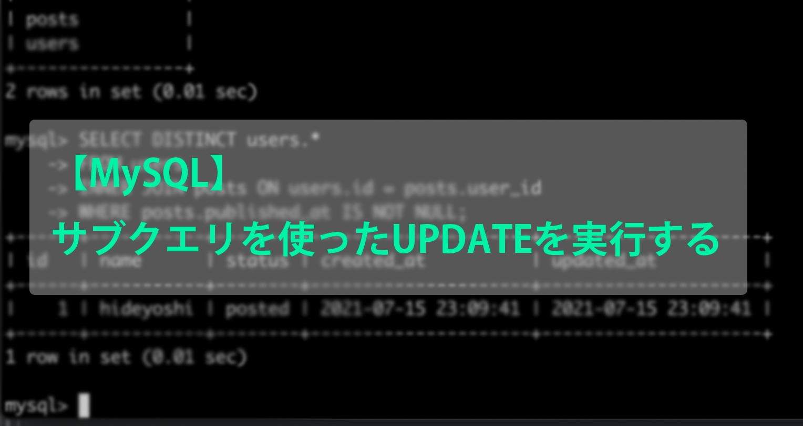
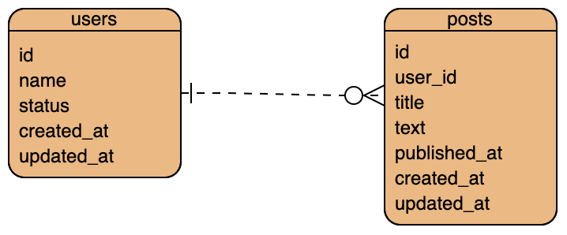

# 【MySQL】サブクエリを使ったUPDATEを実行する

こんにちは。 [GAOGAO](https://gaogao.asia/) にてスタートアップスタジオのエンジニアをしております [@mass-min](https://twitter.com/masumi_sugae) と申します。
GAOGAO では秀吉と呼ばれています。どうぞよろしくお願いいたします。



## 結論

サブクエリで扱うテーブルは、 UPDATE 対象のテーブルとは別物扱いにする必要があります。

更新対象テーブルと同一のテーブルに対してサブクエリを書きたい場合は、サブクエリでの取得結果に対してエイリアスを貼るようにしましょう。

## 前提

下記のようなテーブル構成になっているものとします。



また、DB のレコードは以下のようになっているものとします。

```sql
mysql> SELECT * FROM users;
+------+-----------+------------+---------------------+---------------------+
| id   | name      | status     | created_at          | updated_at          |
+------+-----------+------------+---------------------+---------------------+
|    1 | hideyoshi | registered | 2021-07-15 23:09:41 | 2021-07-15 23:09:41 |
|    2 | nobunaga  | registered | 2021-07-15 23:09:56 | 2021-07-15 23:09:56 |
|    3 | ieyasu    | registered | 2021-07-15 23:10:10 | 2021-07-15 23:10:10 |
+------+-----------+------------+---------------------+---------------------+
3 rows in set (0.01 sec)

mysql> SELECT * FROM posts;
+------+---------+--------------------+-------------------------------+---------------------+---------------------+---------------------+
| id   | user_id | title              | text                          | published_at        | created_at          | updated_at          |
+------+---------+--------------------+-------------------------------+---------------------+---------------------+---------------------+
|    1 |       1 | Osaka-jo manual    | Osaka-jo is good              | NULL                | 2021-07-15 23:11:01 | 2021-07-15 23:11:01 |
|    2 |       1 | KATANAGARI         | HAVING KATANA IS NOT ALLOWED! | 2021-07-15 23:13:45 | 2021-07-15 23:13:45 | 2021-07-15 23:13:45 |
|    3 |       1 | ZORI into FUTOKORO | Hotter it is, Better it is    | 2021-07-15 23:16:36 | 2021-07-15 23:16:36 | 2021-07-15 23:16:36 |
+------+---------+--------------------+-------------------------------+---------------------+---------------------+---------------------+
3 rows in set (0.00 sec)
```

## サブクエリを用いた UPDATE の失敗

`users` テーブルは `status` の default 値が `registered` で、1つでも記事を公開する(`published_at` が null でない `posts` を1つ以上持つ)と以降 `status` は `posted` になる運用をしています。

この UPDATE 処理を日次バッヂ処理で回すことを考えます。

なお、この例は実際の問題をシンプルにしたものなのでサブクエリを使わずとも解決可能な問題ですが、実際のケースではサブクエリ部分にはより複雑なものが入る想定であり、以下の例ではあくまでサブクエリを使うのが適切という前提で話を進めます。

まずは、「1つでも記事を公開している」という条件に当てはまる更新対象 `users` レコードを取得します。思ったことをそのまま SQL にしてみましょう。

```sql
SELECT DISTINCT users.*
FROM users
INNER JOIN posts ON users.id = posts.user_id
WHERE posts.published_at IS NOT NULL;
```

取得結果は以下のようになります。

```sql
mysql> SELECT DISTINCT users.* FROM users INNER JOIN posts ON users.id = posts.user_id WHERE posts.published_at IS NOT NULL;
+------+-----------+------------+---------------------+---------------------+
| id   | name      | status     | created_at          | updated_at          |
+------+-----------+------------+---------------------+---------------------+
|    1 | hideyoshi | registered | 2021-07-15 23:09:41 | 2021-07-15 23:09:41 |
+------+-----------+------------+---------------------+---------------------+
1 row in set (0.00 sec)
```

正しく取得できましたので、今度は上記の SQL で `users` の `id` のみ取得し、それを UPDATE 文のサブクエリに入れ更新を試行します。

```sql
UPDATE users
SET status = 'posted'
WHERE
    id IN (
        SELECT DISTINCT users.id
        FROM users
        INNER JOIN posts ON users.id = posts.user_id
        WHERE posts.published_at IS NOT NULL
    )
;
```

上記 SQL は一見正しいように思えますね。

しかし実行すると、以下のようにエラーが発生します。

```sql
mysql> UPDATE users
    -> SET status = 'posted'
    -> WHERE
    -> id IN (
    -> SELECT DISTINCT users.id
    -> FROM users
    -> INNER JOIN posts ON users.id = posts.user_id
    -> WHERE posts.published_at IS NOT NULL
    -> )
    -> ;
ERROR 1093 (HY000): You can't specify target table 'users' for update in FROM clause
```

## エラー原因・解決方法

結論から言うと、以下のようにサブクエリ部分を書き換えることで解決できます。

```sql
UPDATE users
SET status = 'posted'
WHERE
    id IN (
        SELECT DISTINCT id
        FROM (
            SELECT users.id
            FROM users
            INNER JOIN posts ON users.id = posts.user_id
            WHERE posts.published_at IS NOT NULL
        )
        AS tmp_table
    )
;
```

MySQL では、同一テーブルの条件をサブクエリに入れることは出来ません。ドキュメントでも以下のように記述があります。

> You cannot update a table and select directly from the same table in a subquery. You can work around this by using a multi-table update in which one of the tables is derived from the table that you actually wish to update, and referring to the derived table using an alias.

https://dev.mysql.com/doc/refman/5.6/en/update.html

これは同一のテーブルを参照することにより、サブクエリでの取得結果自体が UPDATE 文によって更新され、それによってサブクエリの取得結果に漏れが生じるため再度サブクエリ部分を取得し直す必要が生じ、でもまた UPDATE 文で更新され...の無限ループに至ることを防いでいると思われます。

極端な例ですが、例えば上記のサブクエリの内容が「`id` が 2以上 の `users`」で更新内容が「`id` を +1 する」であった場合、UPDATE 文によってサブクエリの結果自体が変更されてしまい無限ループに陥ってしまいますね。

したがって、同一のテーブルではなく UPDATE 文では問題にならない、と MySQL に認識させるため、サブクエリの取得結果をエイリアスを用いて置き換え、それを改めて SELECT 文で取得する形を取ります。

各ステップの取得結果を確認してみましょう。

### id 取得用 SQL

以下では取得対象のレコードの組み合わせを INNER JOIN でそのまま全て取得していますが、このステップの時点で DISTINCT の宣言をしても良いです。

```sql
mysql> SELECT users.id FROM users INNER JOIN posts ON users.id = posts.user_id WHERE posts.published_at IS NOT NULL;
+------+
| id   |
+------+
|    1 |
|    1 |
+------+
2 rows in set (0.01 sec)
```

### id 取得用 SQL の取得結果をエイリアスとしてサブクエリ化

```sql
mysql> SELECT DISTINCT id FROM (SELECT users.id FROM users INNER JOIN posts ON users.id = posts.user_id WHERE posts.published_at IS NOT NULL) AS tmp_table;
+------+
| id   |
+------+
|    1 |
+------+
1 row in set (0.00 sec)
```

### さらにサブクエリ化して UPDATE 文を実行

```
mysql> UPDATE users SET status = 'posted' WHERE id IN (SELECT DISTINCT id FROM (SELECT users.id FROM users INNER JOIN posts ON users.id = posts.user_id WHERE posts.published_at IS NOT NULL) AS tmp_table);
Query OK, 1 row affected (0.00 sec)
Rows matched: 1  Changed: 1  Warnings: 0

mysql> SELECT * FROM users;
+------+-----------+------------+---------------------+---------------------+
| id   | name      | status     | created_at          | updated_at          |
+------+-----------+------------+---------------------+---------------------+
|    1 | hideyoshi | posted     | 2021-07-15 23:09:41 | 2021-07-15 23:09:41 |
|    2 | nobunaga  | registered | 2021-07-15 23:09:56 | 2021-07-15 23:09:56 |
|    3 | ieyasu    | registered | 2021-07-15 23:10:10 | 2021-07-15 23:10:10 |
+------+-----------+------------+---------------------+---------------------+
3 rows in set (0.00 sec)
```

これでアップデートができるようになりました。

## まとめ

サブクエリで扱うテーブルは、 UPDATE 対象のテーブルとは別物扱いにする必要があります。

更新対象テーブルと同一のテーブルに対してサブクエリを書きたい場合は、サブクエリでの取得結果に対してエイリアスを貼るようにしましょう。

## 最後に

弊社 GAOGAO は現在副業含めて40名以上のエンジニアの方が参画し、グローバル（シンガポール、バンコク、US、日本など）で20社以上お客様の開発のお手伝いをさせていただいております。

もしグローバルでスキルを試してみたいというエンジニアの方(デザイナーの方も)いましたら、お気軽にご連絡いただければ幸いです！
私秀吉( [@mass-min](https://twitter.com/masumi_sugae) )、弊社代表テジタク( [@tejitak](https://twitter.com/tejitak) )、そしてメンバー一同、皆様からのご連絡お待ちしております！！

世界中で「モノつくり」の連鎖を起こすことができる世界を実現するための仕組みを是非一緒に作っていきましょう！

## 参考URL

https://qiita.com/Kohei-Sato-1221/items/d1cbdc1d3affcd9c3a9e