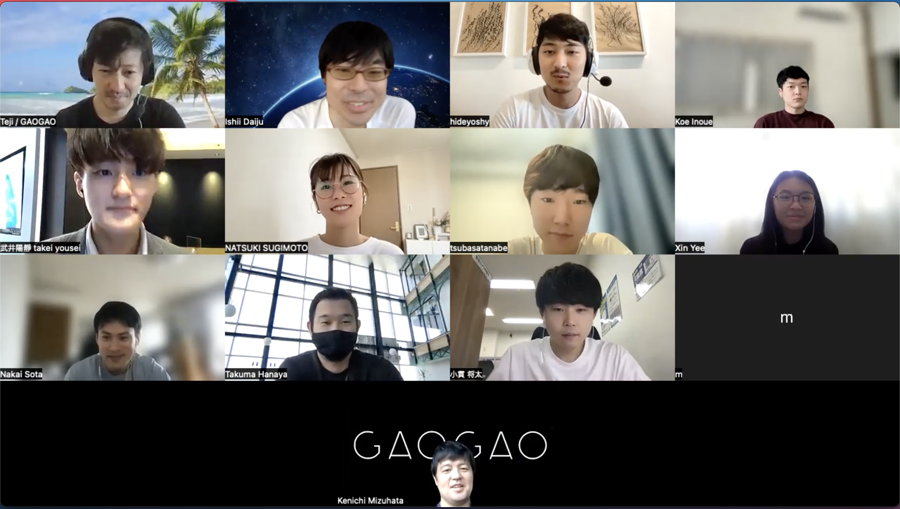

## 2022年6月 初旬

GAOGAO Slackにて、Daijuさんより以下のようなメッセージが流れてきました。

```tex
■日付
日本時間6/26(日)11時〜20時

■会場
オンライン

■開催の目的
働き方のオンライン化でオフラインのイベントなどが減ってきた昨今、仕事上関わらない方たちとのコミュニケーションを取る機会が減ってきたと思います。
GAOGAO内では多くのプロジェクトが現在進行しており、もっとお互いを知れるともっと面白いことができるのでは？という考えのもと、GAOGAOメンバー同士の横のつながりを強めるために今回のハッカソンを企画します。
また、GAOGAOではグローバル活動が加速しているので、今回のハッカソンではテーマ・プレゼンもグローバル色を出していこうかと思います。

■テーマ
「グローバル」(「グローバル」というキーワードに関わるもの)

■プレゼンに関して
今回のプレゼンは英語を推奨。(難しい場合は日本語も可)

■タイムスケジュール(予定)
11:00~11:30　オープニング・ルール説明
11:30~18:00　開発作業(休憩はチームで話し合い随時自由にとってください)
18:00~19:10 各チーム発表・質疑応答(1チーム10分から15分程度)
19:10~19:50　審査・表彰・総評
19:50~20:00　エンディング閉会
20:00~　　　希望者がいればオンライン飲み会(参加・入退室自由)

■審査項目
「問題着眼点」・「アイデア」・「完成度」・「技術力」から総合的に判断

■景品
検討中

以前の様子はこちらから
https://note.com/tejitak/n/ndf204456f655
https://tech.gaogao.asia/hackathon-review-1/
https://twitter.com/search?q=%23GAOGAO%E3%83%8F%E3%83%83%E3%82%AB%E3%82%BD%E3%83%B3&src=typed_query

以上です。ご参加お待ちしております！
```

ということで、もちろん参加してきましたので、レポートしていきます！

## 開催前(2022年6月19日~)

開催直前ということで、早いチームは1週間前から（もしくは、もっと早くから？）チーム毎にSlackチャンネルを作り、コミュニケーションを取っていました。


チーム毎に役割分担を決めて、本番にのぞみました。


# 開催当日(2022年6月26日)

以下開発当日の様子です。

## 開会式 (日本時間11時~)

開会式はタイ時間9時, 日本時間11時よりZoomを用いて行われました。





Daijuさんによる挨拶と開会コール。

テーマは「グローバル」(「グローバル」というキーワードに関わるもの)。

■開催の目的 (再掲)

> 働き方のオンライン化でオフラインのイベントなどが減ってきた昨今、仕事上関わらない方たちとのコミュニケーションを取る機会が減ってきたと思います。
> GAOGAO内では多くのプロジェクトが現在進行しており、もっとお互いを知れるともっと面白いことができるのでは？という考えのもと、GAOGAOメンバー同士の横のつながりを強めるために今回のハッカソンを企画します。
> また、GAOGAOではグローバル活動が加速しているので、今回のハッカソンではテーマ・プレゼンもグローバル色を出していこうかと思います。

その後、早速Gatherに移動してチーム開発が始まります！

## チーム開発 (日本時間11時半~)

チームA, B, Cの3チームに分かれて、Gather等を用いてコミュニケーションを取っていきます。（基本はリモート開発となります）


AチームはFigmaを用いてプロトタイプを作り、本開発は`React`, `Vite`, `Vercel`, `Github Actions`を用いて高速開発を行いました！


時にはGatherでお互いに鼓舞し合いながら、開発を進めていきました。


## 発表&質疑応答タイム (日本時間18時~)

発表はAチーム -> Bチーム -> Cチームの順番で行われました。各チームスライド発表、開発したプロダクトのデモ、Sugimotoさんからの質疑応答という流れで進みました。


・Aチーム: Transresume


・Bチーム: Effort Monster


\- Cチーム: 


## 評価タイム (日本時間19時15分~)


各チームの発表&質疑応答が終わった後、評価者のSugimotoさんより評価をしていただき、結果発表となりました。

優勝はAチームのTransresume！おめでとうございます！ (ありがとうございました！笑)


優勝チームには豪華景品、その他参加チームの皆さんにも参加賞として後日、景品が贈られます。


## 閉会&開発後オンライン飲み会

閉会後は、参加者で集まってオンライン飲み会も開催されたようです！こちらもZoomを用いて行われました。クリエイターが集まって話す機会は貴重なため、大変な盛り上がりでした！！

開発苦労話や技術ネタなど、エンジニアならではの会話も盛り上がりました。


## 最後に

弊社 GAOGAO は現在副業含めて40名以上のエンジニアの方が参画し、グローバル（シンガポール、バンコク、US、日本など）で20社以上お客様の開発のお手伝いをさせていただいております。

もしグローバルでスキルを試してみたいというエンジニアの方(デザイナーの方も)いましたら、お気軽にご連絡いただければ幸いです！ 弊社秀吉( [@mass-min](https://twitter.com/masumi_sugae) )、弊社代表テジタク( [@tejitak](https://twitter.com/tejitak) )、そしてメンバー一同、皆様からのご連絡お待ちしております！！

世界中で「モノつくり」の連鎖を起こすことができる世界を実現するための仕組みを是非一緒に作っていきましょう！