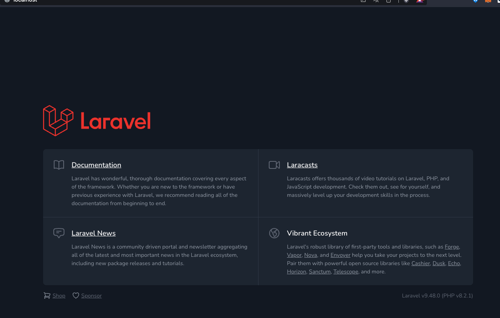
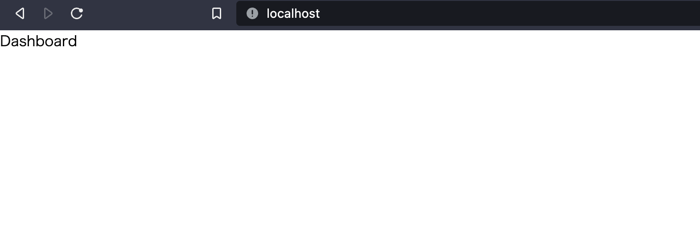
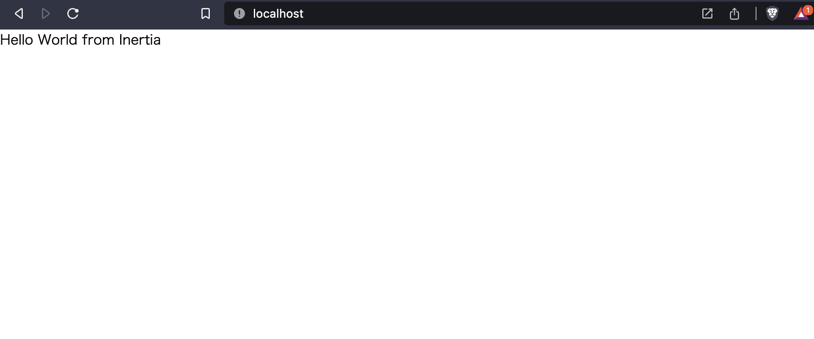
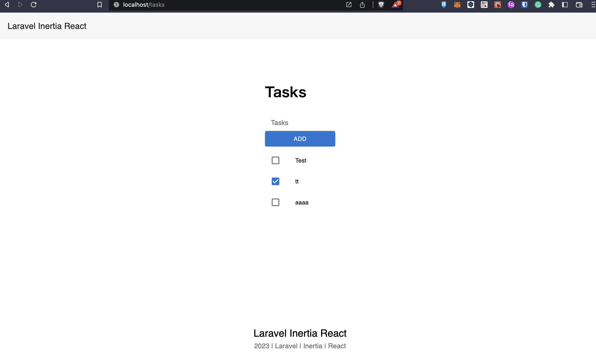

こんにちは。[GAOGAO](https://gaogao.asia/) に所属している [T Tsubasa](https://twitter.com/aburasobablog) と申します。

今回は日本時間 2023 年 1 月 27 日に Version 1.0 がリリースされた [Inertia.js](https://inertiajs.com/) を触ってみた記事になります。

直近の案件では、Laravel を API サーバー, と React をフロントエンド用いて開発した経験もあり、Inertia.js を利用するとどんなメリットがあるか、はたまたどんなデメリットがあるかをまとめていきます。
公式ドキュメントでは Inertia と .js を省略した呼び方をしているため本記事でも以後は Inertia と呼称します。

## 1. はじめに

### Inertia.js とは

> Think of Inertia as glue that connects the two.<br> https://inertiajs.com/

公式ドキュメントにこのように書かれていますが、Inertia は SPA 開発の際にフロントエンドとバックエンドを繋げる接着剤の役割をします。

SPA 開発では、

* バックエンドで API を開発
* フロントエンドでルーティングを行う
* バックエンドとフロントエンドの接続

などのように、実装の複雑さがあります。

Inertia を用いて SPA を開発すると、Laravel の Blade を使っているような感覚で、React（Vue, Svelte も対応）を導入し、SPA を開発することができます。

また、Inertia はどのバックエンドフレームワークでも動作するようになっていますが、特に Laravel で上手く機能するように開発されているようです。

## 2. 導入するメリット ・ デメリット

### メリット

* SPA の開発がスムーズ
  前述の通り、Laravel のテンプレートエンジン Blade を使用しているイメージで Controller から各 Component へ Props を渡すことが可能になっているため、
  気軽に SPA 開発を始めることが可能です。
* Inertia の中には Sharing Data （多くのコンポーネントで参照したい Props）や Form helper などの便利なメソッドも用意されており、他のライブラリを追加せずに Basic な SPA を構築することが可能です。
* Laravel のライブラリである Breeze との相性がよく、認証機能などを SPA でコマンドを叩くだけで容易に実装が可能。一方で、Breeze が JavaScript で構成されているため、TypeScript 化するのには手間がかかる。

### デメリット

* 良くも悪くもバックエンドとフロントエンドを接着剤として結合するため、サービスの規模が大きくなりフロントエンドとバックエンドを分割したい際の移行コストがかかる。

### 結論

* MVP 開発に際して、Blade ではなく SPA 開発で UX を向上させたいと考えた際に導入することを検討したいです。
* 規模の大きいシステムや、開発チームが明確にフロント、バックと分割されている場合には API サーバーとフロントエンドで Repository ごと分割した方が良いと思いました。
* 弊社では、0 → 1 の開発が多いため、Inertia を用いて高速に SPA 開発をする需要はあると感じました。

## 3. Laravel インストールから Inertia 導入方法。

ここでは Inertia と Laravel を用いた開発環境をセットアップする際の流れをまとめていきます。
※ TypeScript 化はここでは省略をします。

### 前提

* node v19.0.0
* Laravel v9.48.0
* React v18.2.0
* react-dom v18.2.0
* Inertia.js v1.0.0
* Vite v4.0.4

開発補助として

* Laravel Sail : Docker 開発環境をコマンドで作成可能。

### Laravel Docker 環境の構築

1. まずは Laravel をインストールしていきます。

`% curl -s "https://laravel.build/inertia-react" | bash`

`inertia-react` の箇所はお好きなアプリケーションの名前に変更してください。

2. Docker Desktop を立ち上げましょう。
   今回、開発環境は Laravel Sail を用いて、Docker 環境を構築します。
   Docker Desktop のアプリケーションをお持ちでない方は [こちら](https://www.docker.com/products/docker-desktop/) からインストールをした後に、アプリケーションを起動してください。
3. Sail で環境を立ち上げ Local で確認する。

`cd inertia-react && ./vendor/bin/sail up -d`

[Localhost](http://localhost/) にアクセスして下記の画面が表示されれば Laravel のインストールと開発環境の構築は完了です！



### ・Inertia サーバーサイドのセットアップ

ここからは[Inertia のドキュメント（サーバーサイドセットアップ）](https://inertiajs.com/server-side-setup)を確認しながら進めていきます。

1. Inertia のインストール
   `composer require inertiajs/inertia-laravel`
2. blade ファイルの変更
   `welcome.blade.php` を `app.blade.php` に変更し、中身を下記に書き換えましょう。

```html
<!DOCTYPE html>
<html>

<head>
    <meta charset="utf-8" />
    <meta name="viewport" content="width=device-width, initial-scale=1.0, maximum-scale=1.0" />
    @viteReactRefresh
    @vite('resources/js/app.jsx')
    @inertia
</head>

<body style="margin: 0">
    @inertia
</body>

</html>
```

3. Middleware
   次に Inertia の Middleware を作成します。

`php artisan inertia:middleware`

Kernel.php の web グループに追加します。

```php
<?php

// 省略

protected $middlewareGroups = [
  'web' => [
      \App\Http\Middleware\EncryptCookies::class,
      \Illuminate\Cookie\Middleware\AddQueuedCookiesToResponse::class,
      \Illuminate\Session\Middleware\StartSession::class,
      \Illuminate\View\Middleware\ShareErrorsFromSession::class,
      \App\Http\Middleware\VerifyCsrfToken::class,
      \Illuminate\Routing\Middleware\SubstituteBindings::class,
      \App\Http\Middleware\HandleInertiaRequests::class, // Added
  ],
```

### ・Inertia クライアントサイドのセットアップ

ここからは[Inertia のドキュメント（クライアントサイドセットアップ）](https://inertiajs.com/client-side-setup)を確認しながら進めていきます。
本記事では React でセットアップを行なっていきます。

1. ライブラリをインストール

`npm i @inertiajs/react`
`npm i react react-dom`
`npm i @vitejs/plugin-react`

Inertia のアダプターをインストール。
React Dom, 及び、コンパイラー Vite の React プラグインをインストールします。

2. app.jsx で Inertia を適用する。

resources / js / app.jsx を下記に変更しましょう。

```jsx
import "./bootstrap";

import { createInertiaApp } from "@inertiajs/react";
import { createRoot } from "react-dom/client";

createInertiaApp({
  resolve: name => {
    const pages = import.meta.glob("./Pages/**/*.jsx", { eager: true });
    return pages[`./Pages/${name}.jsx`];
  },
  setup({ el, App, props }) {
    createRoot(el).render(<App {...props} />);
  }
});
```

3. Vite の設定を React に合わせる。
   vite.config.js を変更して、React の設定を追加しましょう。

```javascript
import { defineConfig } from "vite";
import laravel from "laravel-vite-plugin";
import react from "@vitejs/plugin-react"; // Added

export default defineConfig({
  plugins: [
    laravel({
      input: ["resources/css/app.css", "resources/js/app.jsx"], // Modified
      refresh: true
    }),
    react() // Added
  ]
});
```

### Dashboard を表示する。

1. Routing を Inertia を用いる形に書き換える

```php
<?php

// 省略

// Route::get('/', function () {
//   return view('welcome');
// });　// deleted

Route::inertia('/', 'Dashboard'); // Added
```

上記のように変更を加えることで、/ にアクセスが来た際に、resources/js/pages 配下にある Dashboard コンポーネントを描画することができます。

2. Dashboard コンポーネントを作成する。

ルーティングができたので、resources/js/pages 配下に Dashboard.jsx を作成しましょう。

```javascript
const Dashboard = () => {
  return <>Dashboard</>;
};
export default Dashboard;
```

[Localhost](http://localhost/)にアクセスして下記の画面が表示されれば、web.php から React Component を表示することができることを確認できます。



3. Props を Controller から Component に渡す。

次に、Props を Controller から Component に渡してみましょう。
Laravel のテンプレートエンジンである Blade に変数を受け渡すのと同じように実装することが可能です。

まずは web.php を変更し、新規作成した DashboardController に接続しましょう。

```php
<?php

// 省略

// Route::inertia('/', 'Dashboard'); // Deleted
Route::get('/', [DashboardController::class, 'index'])->name('dashboard.index'); //Added
```

次に DashboardController に index メソッドを定義します。

```php
<?php

namespace App\Http\Controllers;

use Inertia\Inertia;

class DashboardController extends Controller
{
    public function index()
    {
        $hello = 'Hello World from Inertia';
        return Inertia::render('Dashboard', [
            'hello' => $hello,
        ]);
    }
}
```

`$hello`という変数を定義し、Blade に変数を渡す書き方で、Component に Props を渡すことができます。

次に Dashboard Component で Props を受け取り表示をしましょう。

```javascript
const Dashboard = ({ hello }) => {
  return <>{hello}</>;
};

export default Dashboard;
```



このようにして、Controller から Props を受け渡すことが可能です。

## 4 簡易 Todo アプリ作成を通して、有用性を確認する

ここからは詳細は省きますが、作成画面から入力した値を Todo 一覧として表示する機能をどのように実装するかポイントを見て行きましょう。

### Controller でのポイント

`index` メソッドでは、先ほどのように Props として DB から取得したタスクを全て Task/Index コンポーネントに渡すことができます。

`store` メソッドで `to_route` を用いることで Task を新規作成した後に、Task/Index コンポーネントを再レンダリングすることが可能です。

```php
<?php

// 省略

class TaskController extends Controller
{

    public function index()
    {
        $tasks = Task::all();
        return Inertia::render('Tasks/Index', [
            'tasks' => $tasks,
        ]);
    }

    public function store(Request $request)
    {
        Task::create($request->validate([
            'name' => ['required', 'max:10'],
          ]));
          return to_route('tasks.index');
    }
```

## Task 一覧画面 UI

下記は Material UI を用いて簡単な Task 一覧画面とフォームを構築しています。
Inertia の `useForm` メソッドを用いて Form の操作を行います。
また、`post` メソッドを用いることで、特定の URL にデータをポストし、ポスト成功時の操作も行うことが可能です。

```javascript
import { useForm } from "@inertiajs/react";
import { FormControl, InputLabel, Input, Button } from "@mui/material";
import TaskList from "../../Components/Tasks/TaskList";
import Layout from "../../Layouts/Layout";

const Index = ({ tasks }) => {
  const { data, setData, post, processing, errors, isDirty } = useForm({
    name: ""
  });

  const submit = e => {
    e.preventDefault();
    post("/tasks", {
      onSuccess: () => setData("name", "")
    });
  };
  return (
    <Layout>
      <>
        <h1>Tasks</h1>
        <form onSubmit={submit}>
          <FormControl>
            <InputLabel htmlFor="task">Tasks</InputLabel>
            <Input
              id="task"
              aria-describedby="task-name"
              value={data.name}
              onChange={e => setData("name", e.target.value)}
            />
            {errors.name && <div>{errors.name}</div>}
            <Button variant="contained" type="submit" disabled={processing}>
              Add
            </Button>
          </FormControl>
        </form>
        <TaskList tasks={tasks} />
      </>
    </Layout>
  );
};

export default Index;
```

Layout コンポーネント等の実装は省きましたが、上記の実装をすることで下記のような SPA アプリケーションを作成することができます。
API の構築などをせず、Blade テンプレートで実装しているイメージで SPA アプリケーションを実装することができました。



## 5. まとめ

今回は Inertia の導入のメリットデメリット及び、簡単な導入方法について見てまいりました。

* Laravel, React（など）で SPA 開発をする場合にスピード感を保ちながら開発できる。特に MVP 開発などに良い。
* フロントエンドとバックエンドが良くも悪くも密結合になるため、大規模になりリポジトリを分ける等の必要性が出てきた場合にハードルがある。

メリット、デメリットがありましたが、0 → 1 開発フェーズ等スピード感を保ちつつ、SPA 開発をしたい時には力になってくれるライブラリであると思います。

## 最後に

弊社 GAOGAO は現在多数のエンジニアの方が参画し、グローバル（シンガポール、バンコク、US、日本など）でお客様の開発のお手伝いをさせていただいております。

もしグローバルでスキルを試してみたいというエンジニアの方(デザイナーの方も)いましたら、お気軽にご連絡いただければ幸いです！
弊社秀吉( [@mass-min](https://twitter.com/masumi_sugae) )、弊社代表テジタク( [@tejitak](https://twitter.com/tejitak) )、そしてメンバー一同、皆様からのご連絡お待ちしております！！

世界中で「モノつくり」の連鎖を起こすことができる世界を実現するための仕組みを是非一緒に作っていきましょう！